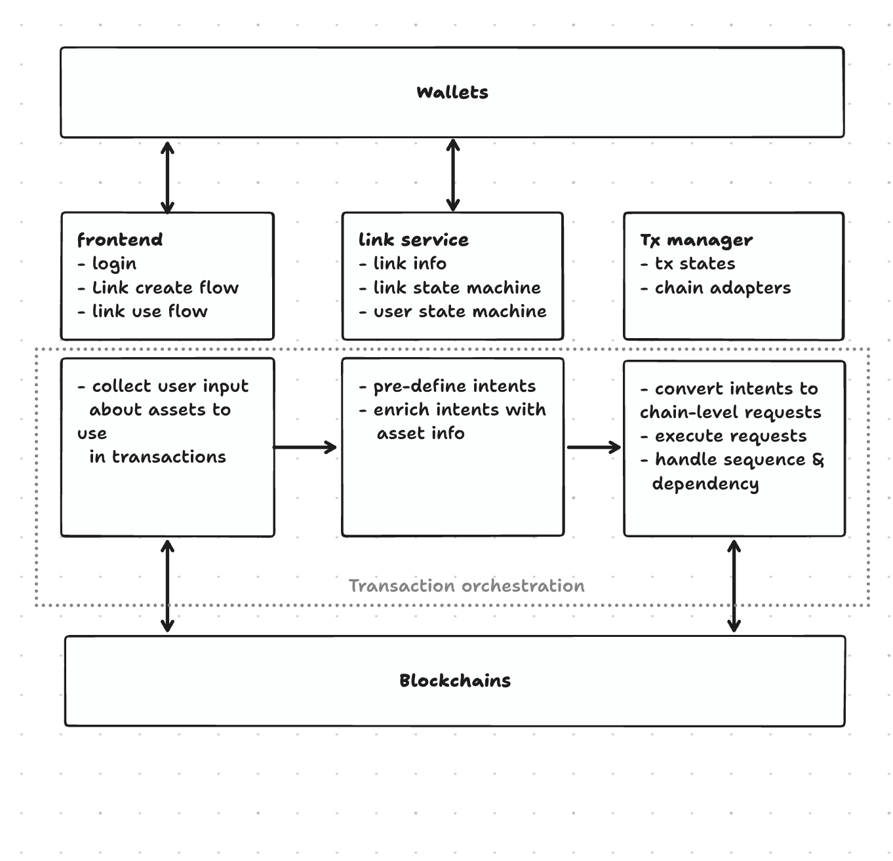

# Cashier

Cashier is a no-code transaction builder for non-technical users, such as marketers, solopreneurs, or consumers.

With Cashier, users can build and share payment, donation, tip, airdrop, swap, etc in minutes from their phone. It's quick, easy, and cheap. For custom needs, Cashier also supports flexible transaction flows and gating rules. Users can focus on their transaction needs rather than implementation.

**URL:** [cashierapp.io](https://cashierapp.io)

[](https://www.youtube.com/watch?v=H8Qetnjz1Zs)

## 🎯 Introduction

On a user level, Cashier is about providing a no-code transaction builder for non-technical users. The aim is to build a vast library of transaction templates that users can pick from and use quickly and easily.

Technically, Cashier is all about flexibly configuring and executing different types of transactions. Cashier does this by orchestrating different types of transactions. Following is how it works:

-   Each transaction is defined by what type of transfers it makes (i.e. a tip link will transfer an asset from the transaction link to the user wallet). Such behaviors for each transaction / link type is pre-configured in link service.
-   The frontend collects user input on what type of assets the users want to use in the transactions.
-   The transaction manager generates blockchain level requests and executes the transactions. Link to wallet transactions are executed on the backend while wallet to link transactions are executed by triggering the connected wallet.



## 🚀 Quick Start

### Prerequisites

-   [Rust](https://www.rust-lang.org/tools/install)
-   [DFX](https://internetcomputer.org/docs/building-apps/getting-started/install)
-   [NodeJS](https://nodejs.org/en)

### Installation

**Frontend:**

```bash
# Install all dependencies
npm install

# Run local development server
npm start
```

**Backend:**

```bash
# Build backend canister
make build-backend

# Build token storage canister
make build-token-storage
```

## 🏗️ Deployment Setup

### CI/CD Automated Deployment

Cashier uses an automated CI/CD pipeline for seamless deployments across multiple environments:

#### 🚀 Quick Reference

| Trigger                | Environment   | Version Bump   | Use Case               |
| ---------------------- | ------------- | -------------- | ---------------------- |
| Push to **any branch** | 🧪 Dev        | ❌ No          | Feature testing        |
| PR to **staging**      | 🔧 Staging    | ❌ No          | Pre-production testing |
| PR to **main**         | 🚀 Production | ✅ Yes (patch) | Live release           |

#### Examples

```bash
# Deploy feature to dev
git push origin feature/new-feature  # ✅ Auto-deploys to dev

# Deploy to staging
# Create PR: feature/new-feature → staging  # ✅ Auto-deploys to staging

# Deploy to production (with version bump)
# Create PR: staging → main  # ✅ Version 0.0.9 → 0.0.10, deploys to production
```

📖 **[Complete Deployment Guide](docs/DEPLOYMENT.md)** - Detailed documentation with examples, troubleshooting, and best practices.

### Manual Deployment

#### Quick Start

For lazy deployment with pre-configured identities, use the enhanced deployment script:

```bash
./scripts/deploy.sh
```

#### Identity Configuration

**Private Identity Management**

The deployment script supports storing identities in a private configuration file that won't be committed to git:

1. **Create/Edit Configuration File**: The script will automatically create `.deploy-config` if it doesn't exist, or you can manually create it:

```bash
# .deploy-config (this file is gitignored)
# Format: network=identity_name

staging=<DEPLOYER IDENTITY>
dev=<DEPLOYER IDENTITY>
```

2. **Automatic Identity Detection**: When running the script, it will:
    - Look for stored identity for the selected network
    - Prompt to use the stored identity (default: yes)
    - If no identity is stored, prompt for manual input and offer to save it

#### Deployment Networks

Available networks:

-   `ic` - Internet Computer mainnet (uses `.env.production`)
-   `staging` - Staging environment (uses `.env.staging`)
-   `dev` - Development environment (uses `.env.dev`)
-   `local` - Local development (uses `.env.local`)

#### Available Packages

-   `cashier_backend` - Main backend canister
-   `token_storage` - Token storage canister
-   `cashier_frontend` - Frontend application

#### Deployment Examples

**Interactive deployment:**

```bash
./scripts/deploy.sh
# Follow prompts for network, package, and identity
```

**Skip configuration (uses local network):**

```bash
./scripts/deploy.sh --skip
```

**Manual dfx deployment:**

```bash
# Set environment variables first
source .env.local
dfx deploy cashier_backend --network local --identity your-identity
```

#### Environment Files

Make sure you have the appropriate environment file for your target network:

-   `.env.production` - for IC mainnet
-   `.env.staging` - for staging
-   `.env.dev` - for development
-   `.env.local` - for local development

Each environment file should contain the necessary configuration variables for that specific deployment environment.

## 📱 Usage

Using Cashier is easy. Start by going to [cashierapp.io](https://cashierapp.io) and log in with Internet Identity. We will support more login options going forward.

**Create a transaction in 3 easy steps:**

-   Choose transaction type
-   Select assets to use in the transaction
-   Generate the transaction

And share the link for others to use.

**The link user can use the link in following steps:**

-   Tap on link to open the transaction page
-   Pick a wallet to transact with
-   Execute the transaction

## 📚 Documentation

### Project Documentation

**Development & Deployment:**

-   **[🚀 Deployment Guide](docs/DEPLOYMENT.md)** - Complete CI/CD workflow, version management, and deployment strategies
-   [Backend README](src/cashier_backend/README.md) - Backend canister documentation
-   [Frontend README](src/cashier_frontend/README.md) - Frontend application documentation
-   [Local Tests](src/test/local-tests/README.md) - Local testing setup and re-entrancy protection tests

**Architecture & Design:**

-   [Cashier project overview](https://doc.clickup.com/9012452868/d/h/8cjy7g4-4292/9a3796b6e853ef0)
-   [High level architecture overview](https://doc.clickup.com/9012452868/d/h/8cjy7g4-5612/2e2ccfa01dd19ed)
-   [Link service](https://doc.clickup.com/9012452868/d/h/8cjy7g4-5632/4eeacf618d589c1)
-   [Tx manager](https://doc.clickup.com/9012452868/d/h/8cjy7g4-5552/d32e7c7bddd8747)
-   [Link <> Intent mapping](https://doc.clickup.com/9012452868/d/h/8cjy7g4-5572/2061969b0764510)
-   [Intent <> Tx mapping](https://doc.clickup.com/9012452868/d/h/8cjy7g4-5592/5bcdb847ae9a219)

# Testing

## Backend Unit Tests

For backend unit tests, go to `src/cashier_backend` and run:

```bash
cargo test
```

## Code Quality (Clippy)

The project uses Clippy for Rust code linting across all crates. Run Clippy checks with:

```bash
# Run Clippy on all crates
bash scripts/clippy.sh

# Apply automatic fixes
bash scripts/clippy.sh --fix

# List all crates that will be checked
bash scripts/clippy.sh --list

# Get help
bash scripts/clippy.sh --help
```

**Crates checked**:

-   `src/cashier_backend` - Main backend canister
-   `src/token_storage` - Token storage canister
-   `src/lib/cashier-types` - Shared type definitions
-   `src/lib/cashier-macros` - Procedural macros

The Clippy configuration (`.clippy.toml`) is tuned for IC canister development with appropriate thresholds for complexity, function length, and other metrics.

## Integration Tests

Setup

```bash
# install nodejs packages
npm i

# build backend wasm and move to artifacts
make setup-test

# generate ts file for interacting with test code in typescript
make g
```

For integration tests, run:

```bash
npm run test:integration-backend
```

## Local Re-entrancy Protection Tests

The project includes comprehensive local tests that verify re-entrancy protection mechanisms for critical API endpoints. These tests ensure that concurrent calls are properly handled through request locking.

### Setup

Start dfx local:

```bash
dfx start --clean
```

Deploy canisters:

```bash
bash src/test/scripts/setup.sh
```

### Running Local Tests

```bash
# Run all local tests
npm test src/test/local-tests

# Run specific test files
npm test src/test/local-tests/src/request_lock/create_action.spec.ts
npm test src/test/local-tests/src/request_lock/process_action.spec.ts
```

### Test Coverage

**`create_action.spec.ts`**:

-   Tests concurrent `create_action` calls with request locking
-   Prevents duplicate actions from being created simultaneously

**`process_action.spec.ts`**:

-   Tests basic and concurrent `process_action` calls
-   Tests complete ICRC-112 flow with parallel operations
-   Tests concurrent `trigger_transaction` and `update_action` calls
-   Includes multi-identity testing (creator + claimer scenarios)

For detailed information about the local tests, see [`src/test/local-tests/README.md`](src/test/local-tests/README.md).

# Roadmap

✅ Done

-   Link service foundation
-   Transaction manager foundation
-   Link and user state machines
-   Frontend link creation and user flow foundation
-   Wallet foundation
-   4 basic transaction use cases (tip, airdrop, token basket, payment)

To do
(not in any particular order and priority may change)

-   Additional transaction use cases (swap, donation, checkout, etc).
-   Alternative login (Google, passkey, etc).
-   Transaction speed optimization with ICRC-2.
-   NFT (EXT or ICRC7) support.
-   Gating mechanism foundation.
-   Gating use cases: password, X, Telegram, KYC, etc).
-   Wallet asset swaps.
-   ck tokens import export.
-   Additional chain support (BTC, ETH, SOL).
-   Backoffice (analytics, support solutions, etc).

## License

This project is licensed under the [MIT License](LICENSE).

License changed from **GNU GPL v3.0** to **MIT** on 2025-06-09, prior to public release. No external contributions existed under the previous license.

# Acknowledgements

Cashier has received help from the following projects.

-   Cashier is using NFID's Identity Kit.
-   Cashier benchmarked Kong Swap's transaction architecture.
-   Cashier benchmarked Oisy's token management architecture.

We extend big thanks to aforementioned teams.

# References

-   [Internet Computer](https://internetcomputer.org/)
-   [ICRC-112: Batch Call Canister](https://github.com/dfinity/wg-identity-authentication/blob/main/topics/icrc_112_batch_call_canister.md#partial-responses)
-   [NFID Identity Kit](https://identitykit.xyz/)
-   [ICRC ledger](https://github.com/dfinity/ic/tree/master/rs/rosetta-api/icrc1)
