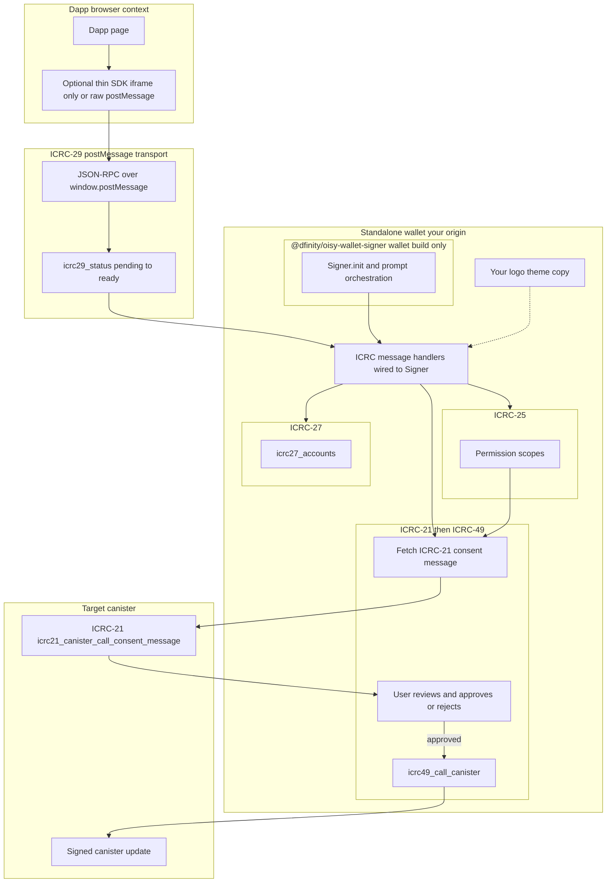

# `@dfinity/oisy-wallet-signer` inside a standalone whitelabel wallet

This note describes a setup where **`@dfinity/oisy-wallet-signer` is part of the wallet build**, not a dependency of every dApp. The library’s **`Signer`** API (`@dfinity/oisy-wallet-signer/signer`) runs **on the wallet origin**: it registers prompts for ICRC-25 / ICRC-27 / ICRC-21 / ICRC-49 and orchestrates consent and calls **under the hood**. **dApps** only need to talk **ICRC-29** to that wallet (typically embed an iframe and exchange JSON-RPC over `postMessage`). They do **not** need to `npm install @dfinity/oisy-wallet-signer`.

This complements [wallet-consent-standards-analysis.md](./wallet-consent-standards-analysis.md).

The upstream README states the library is *primarily developed for [OISY Wallet](https://oisy.com)* but *can be integrated into any wallet or project seeking signer capabilities*—that **wallet** integration path is what we lean on here.

---

## Architecture diagram

**How to read it**

- **dApp:** integrates via **ICRC-29** only. A **minimal** helper (optional) can open the iframe and run the handshake; it must **not** require `@dfinity/oisy-wallet-signer` on the dApp if you want zero OISY npm dependency there.
- **`@dfinity/oisy-wallet-signer`:** lives **inside the wallet** bundle, driving **when** prompts run and how ICRC-21 precedes ICRC-49 inside your whitelabel UI.
- **Target canister:** ICRC-21 and the signed update are defined by the **app canister** being called.

---

## Dependency split

| Layer | `@dfinity/oisy-wallet-signer` | What the dApp uses instead |
|--------|--------------------------------|-----------------------------|
| **Wallet** | **Yes** — `Signer.init`, `register` prompts for ICRC-25 / 27 / 21 / 49, `disconnect`. | N/A |
| **dApp** | **No** (by design) | **ICRC-29** wire protocol: `postMessage` + JSON-RPC, `icrc29_status`, then `icrc25_*`, `icrc27_*`, `icrc49_*` as specified. Optional: a **small wallet-maintained SDK** that only wraps iframe URL + handshake + thin RPC (similar in spirit to [`CashierWalletSignerAdapter`](../src/cashier-wallet-sdk/src/CashierWalletSignerAdapter.ts) + [`IframeTransport`](../src/cashier-wallet-sdk/src/IframeTransport.ts), which use `@slide-computer/signer`—also **not** OISY on the dApp). |

**Whitelabel** stays the same: your **URL**, **theme**, and **copy** ship in the standalone wallet; the OISY package is an implementation detail of that app.

---

## dApp integration (no OISY npm package)

1. **Embed** the wallet at your published origin (hidden iframe or documented entry URL).
2. Complete **ICRC-29** handshake (`icrc29_status` until `ready`).
3. Send **JSON-RPC** messages for the signer methods your flow needs (`icrc25_request_permissions`, `icrc27_accounts`, `icrc49_call_canister`, etc.).

Any dApp that implements the above speaks to your wallet **whether or not** the wallet uses `@dfinity/oisy-wallet-signer` internally. Forcing dApps to install OISY’s client (`IcpWallet`, etc.) is **not** required for that contract.

If you publish a **wallet-owned SDK**, keep it limited to **transport + types** (origin, timeouts, optional `SignerAgent` bridge) so third-party apps are not pulled into **`@dfinity/oisy-wallet-signer`** as a transitive dependency unless you explicitly choose to expose it.

---

## Wallet integration (where OISY Signer lives)

On the **wallet** side, use **`Signer`** from `@dfinity/oisy-wallet-signer/signer` and register prompts for:

- **ICRC-25** — `ICRC25_REQUEST_PERMISSIONS`
- **ICRC-27** — accounts
- **ICRC-21** — consent message before signing
- **ICRC-49** — call canister (status callbacks)

Wire each prompt to **your** Svelte/React components so approvals and consent modals match whitelabel branding. Call `signer.disconnect()` on logout or unload (per upstream docs).

This replaces or augments a hand-rolled `icrc29-handler` as long as the **observable** ICRC behavior matches what dApps send over **ICRC-29**.

---

## Relationship to this repository

- **`CashierWalletSignerAdapter`** already keeps **heavy signer logic off the dApp** by using **`@slide-computer/signer`** + **`walletOrigin`**—the dApp depends on **our** SDK, not on `@dfinity/oisy-wallet-signer`.
- Moving **orchestration** to **`@dfinity/oisy-wallet-signer`’s `Signer`** is a **wallet** change: add the dependency to the **wallet** package, implement prompts, keep the **ICRC-29** surface stable for existing and future dApps.

Treat **ICRC-29 + method behavior** as the public contract to dApps; **`@dfinity/oisy-wallet-signer`** as a **wallet-internal** library.

---

## References

- [OISY Wallet Signer — usage in a wallet](https://github.com/dfinity/oisy-wallet-signer#writing_hand-usage-in-a-wallet) (`Signer.init`, prompts)
- [OISY Wallet Signer (npm)](https://www.npmjs.com/package/@dfinity/oisy-wallet-signer)
- [ICRC-29: window postMessage transport](https://github.com/dfinity/ICRC/tree/main/ICRCs/ICRC-29)
- [Wallet consent and ICRC analysis](./wallet-consent-standards-analysis.md)
