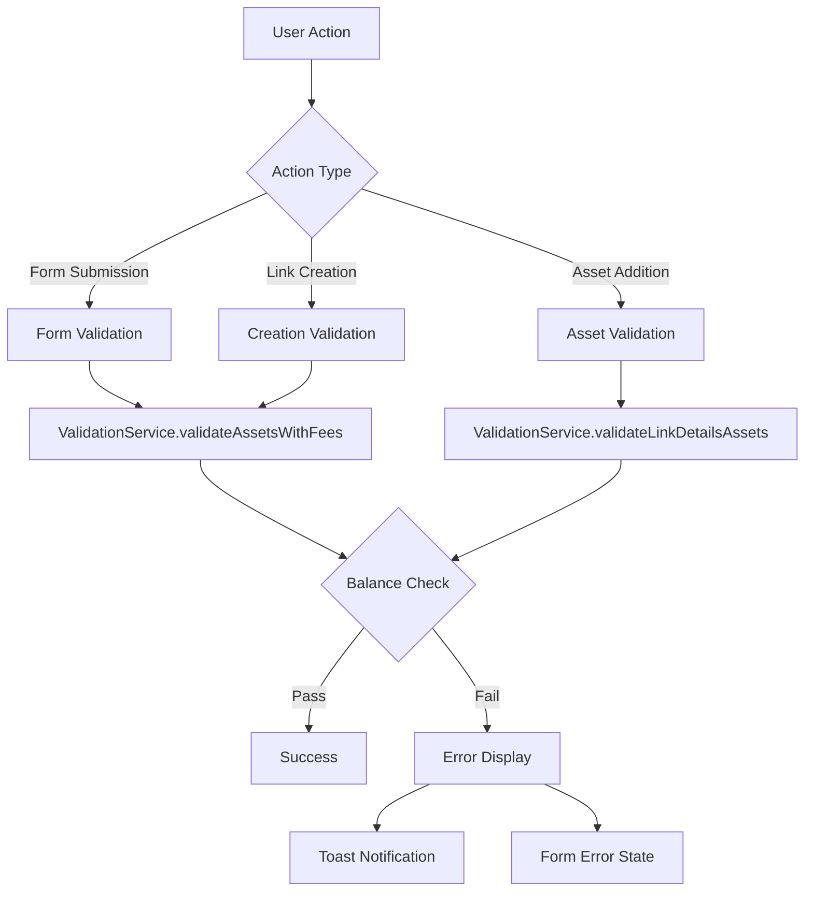

# Token Amount Checking Flow Diagram

## Validation Flow Overview



## Token Amount Calculation by Page

### 1. SendTipForm

```
┌─────────────────────────────────────────────────────────────┐
│ SendTipForm Token Amount Checking                           │
├─────────────────────────────────────────────────────────────┤
│ Hook: useSendTipFormHandler                                 │
│ Validation: Form Submission                                 │
│ Formula: asset.amount + networkFee                          │
│ Link Creation Fee: ❌ Not included                          │
│ Balance Required: ✅ Yes                                     │
│ Error Template: error.balance.insufficient_balance         │
│                                                             │
│ Example (1 ICP tip):                                       │
│ Required: 1.0000 ICP (amount) + 0.0001 ICP (fee)          │
│ Total: 1.0001 ICP                                          │
└─────────────────────────────────────────────────────────────┘
```

### 2. SendAirdropForm

```
┌─────────────────────────────────────────────────────────────┐
│ SendAirdropForm Token Amount Checking                       │
├─────────────────────────────────────────────────────────────┤
│ Hook: useSendAirdropFormHandler                             │
│ Validation: Form Submission                                 │
│ Formula: (asset.amount + networkFee) × maxActionNumber     │
│ Link Creation Fee: ❌ Not included                          │
│ Balance Required: ✅ Yes                                     │
│ Error Template: error.balance.insufficient_balance         │
│                                                             │
│ Example (1 ICP × 10 claims):                               │
│ Required: (1.0000 + 0.0001) × 10 = 10.001 ICP             │
│ Total: 10.001 ICP                                          │
└─────────────────────────────────────────────────────────────┘
```

### 3. SendTokenBasketForm

```
┌─────────────────────────────────────────────────────────────┐
│ SendTokenBasketForm Token Amount Checking                   │
├─────────────────────────────────────────────────────────────┤
│ Hook: useSendTokenBasketFormHandler                         │
│ Validation: Form Submission                                 │
│ Formula: asset.amount + networkFee                          │
│ Link Creation Fee: ❌ Not included                          │
│ Balance Required: ✅ Yes                                     │
│ Error Template: error.balance.insufficient_balance         │
│                                                             │
│ Example (Multiple assets):                                  │
│ Asset 1: 1.0001 ICP                                        │
│ Asset 2: 10.0001 ckUSDC                                    │
│ Asset 3: 0.1001 CHAT                                       │
└─────────────────────────────────────────────────────────────┘
```

### 4. ReceivePaymentForm

```
┌─────────────────────────────────────────────────────────────┐
│ ReceivePaymentForm Token Amount Checking                    │
├─────────────────────────────────────────────────────────────┤
│ Hook: useReceivePaymentFormHandler                          │
│ Validation: Form Submission (Balance Skipped)              │
│ Formula: N/A                                               │
│ Link Creation Fee: ❌ Not included                          │
│ Balance Required: ❌ No (recipient provides tokens)         │
│ Error Template: N/A                                        │
│                                                             │
│ Note: No balance checking required as the recipient        │
│ (not creator) provides the tokens                          │
└─────────────────────────────────────────────────────────────┘
```

### 5. LinkPreview (Creation)

```
┌─────────────────────────────────────────────────────────────┐
│ LinkPreview Token Amount Checking                          │
├─────────────────────────────────────────────────────────────┤
│ Hook: useLinkPreviewValidation                              │
│ Validation: Balance + Creation                              │
│ Formula: asset.amount + networkFee + linkCreationFee       │
│ Link Creation Fee: ✅ Configurable (usually included)       │
│ Balance Required: ✅ Yes                                     │
│ Error Template: error.balance.insufficient_balance_create  │
│                                                             │
│ Example (1 ICP tip creation):                              │
│ Required: 1.0000 (amount) + 0.0001 (network) + 0.001 (creation) │
│ Total: 1.0011 ICP                                          │
└─────────────────────────────────────────────────────────────┘
```

### 6. AddAssetForm

```
┌─────────────────────────────────────────────────────────────┐
│ AddAssetForm Token Amount Checking                         │
├─────────────────────────────────────────────────────────────┤
│ Hook: Direct ValidationService usage                       │
│ Validation: Asset Addition (Real-time)                     │
│ Formula: asset.amount + networkFee                          │
│ Link Creation Fee: ❌ Not included                          │
│ Balance Required: ✅ Yes                                     │
│ Error Template: error.balance.insufficient_balance         │
│                                                             │
│ Example (Real-time validation):                            │
│ User selects 1 ICP → Immediate check for 1.0001 ICP       │
│ ✅ Available: 2.5 ICP → Allow                              │
│ ❌ Available: 0.5 ICP → Show error                         │
└─────────────────────────────────────────────────────────────┘
```

## Detailed Flow by Use Case

### Form Submission Flow

```
User fills form → Form validation → useFormSubmissionHandler
                    ↓
        ValidationService.validateAssetsWithFees
                    ↓
        useCase: "create", includeLinkCreationFee: false
                    ↓
        Check: userBalance >= (amount + networkFee)
                    ↓
        ✅ Pass: Submit to backend
        ❌ Fail: Show error toast
```

### Link Creation Flow

```
User clicks "Create" → Preview validation → useLinkPreviewValidation
                         ↓
        validateBalanceWithCreationFee
                         ↓
        ValidationService.validateAssetsWithFees
                         ↓
        useCase: "create", includeLinkCreationFee: true
                         ↓
        Check: userBalance >= (amount + networkFee + creationFee)
                         ↓
        ✅ Pass: Create link
        ❌ Fail: Show creation error
```

### Asset Addition Flow

```
User adds asset → Real-time validation → validateAssets function
                    ↓
        ValidationService.validateLinkDetailsAssets
                    ↓
        skipCheckingBalance: false
                    ↓
        Check: userBalance >= (amount + networkFee)
                    ↓
        ✅ Pass: Allow asset addition
        ❌ Fail: Show inline error
```

## Error Message Flow

### Template Resolution

```
ValidationError {
    code: INSUFFICIENT_BALANCE,
    message: "error.balance.insufficient_balance",
    metadata: {
        tokenSymbol: "ICP",
        available: "0.5000",
        required: "1.0001"
    }
}
                    ↓
Translation system (i18next)
                    ↓
"Insufficient ICP balance. Available: 0.5000, Required: 1.0001"
                    ↓
Toast notification or form error display
```

### Error Display Locations

```
┌─────────────────────────────────────────────────────────────┐
│ Error Display by Component                                  │
├─────────────────────────────────────────────────────────────┤
│ Form Components     → Toast notifications                   │
│ LinkPreview        → Toast notifications                   │
│ AddAssetForm       → Inline form errors                    │
│ LinkTemplate       → Toast + validation state             │
└─────────────────────────────────────────────────────────────┘
```

## Token Fee Calculation Details

### Network Fees by Token

```
ICP: 0.0001 ICP
ckUSDC: 0.000001 ckUSDC
CHAT: 0.0001 CHAT
Other ICRC-1: Varies by token
```

### Link Creation Fee

```
Fixed: 0.001 ICP (paid in ICP regardless of asset type)
Applied: Only during final link creation
Required: Creator must have ICP balance for this fee
```

### Total Amount Examples

| Link Type          | Asset  | Amount | Claims | Network Fee | Creation Fee | Total Required   |
| ------------------ | ------ | ------ | ------ | ----------- | ------------ | ---------------- |
| Send Tip           | ICP    | 1.0    | 1      | 0.0001      | -            | 1.0001 ICP       |
| Send Airdrop       | ICP    | 1.0    | 5      | 0.0001×5    | -            | 5.0005 ICP       |
| Token Basket       | ckUSDC | 10.0   | 1      | 0.000001    | -            | 10.000001 ckUSDC |
| Creation (Tip)     | ICP    | 1.0    | 1      | 0.0001      | 0.001        | 1.0011 ICP       |
| Creation (Airdrop) | ICP    | 1.0    | 5      | 0.0005      | 0.001        | 5.0015 ICP       |

## Performance Optimizations

### Token Map Usage

```typescript
// Before (O(n) search)
const token = allTokens.find((t) => t.address === assetAddress);

// After (O(1) lookup)
const tokenMap = createTokenMap();
const token = tokenMap[assetAddress];
```

### Validation Consolidation

```typescript
// Before (Multiple validation calls)
const balanceCheck = checkBalance(assets);
const feeCalculation = calculateFees(assets);
const formValidation = validateForm(assets);

// After (Single unified call)
const result = ValidationService.validateAssetsWithFees(assets, tokenMap, options);
```

## Testing Scenarios

### Balance Testing Matrix

```
┌─────────────────────────────────────────────────────────────┐
│ Test Scenario Matrix                                        │
├─────────────────────────────────────────────────────────────┤
│ Scenario 1: Sufficient balance                             │
│ User balance: 10 ICP                                       │
│ Required: 1.0001 ICP                                       │
│ Expected: ✅ Validation passes                               │
│                                                             │
│ Scenario 2: Insufficient balance                           │
│ User balance: 0.5 ICP                                      │
│ Required: 1.0001 ICP                                       │
│ Expected: ❌ Error with template message                     │
│                                                             │
│ Scenario 3: Exact balance                                  │
│ User balance: 1.0001 ICP                                   │
│ Required: 1.0001 ICP                                       │
│ Expected: ✅ Validation passes                               │
│                                                             │
│ Scenario 4: Creation fee edge case                         │
│ User balance: 1.0001 ICP (enough for asset, not creation)  │
│ Required: 1.0011 ICP (with creation fee)                   │
│ Expected: ❌ Creation-specific error                         │
└─────────────────────────────────────────────────────────────┘
```
