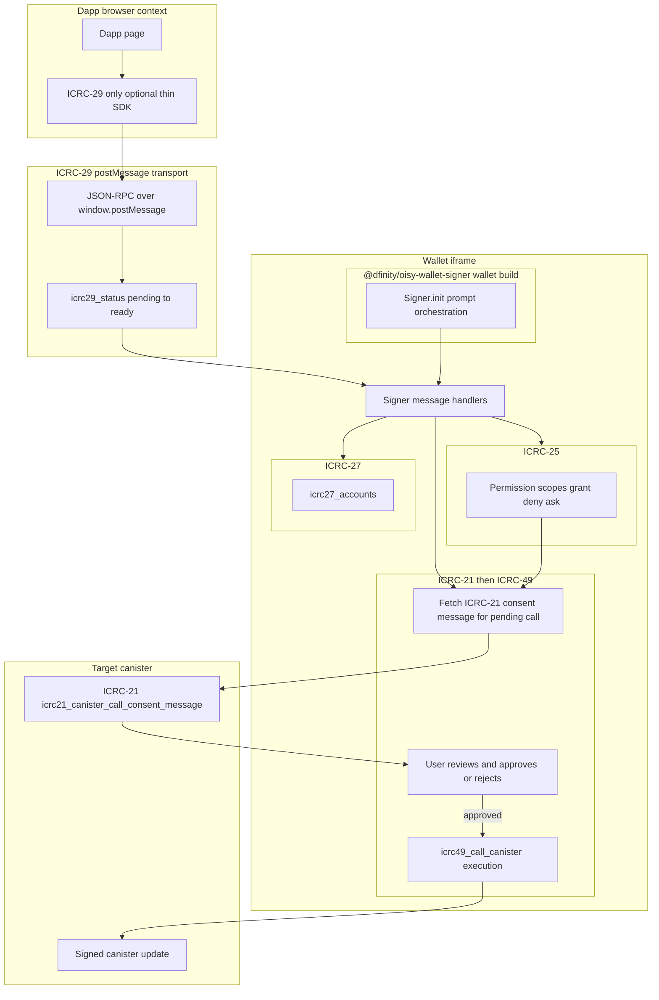
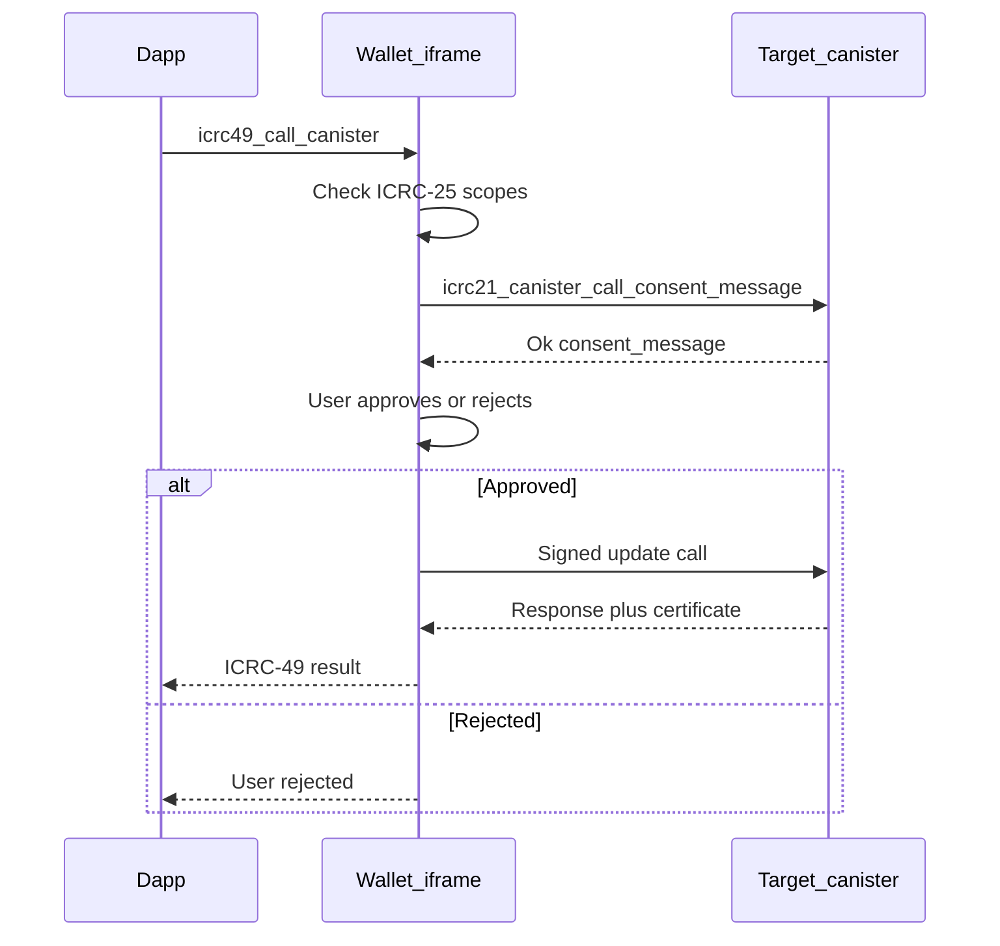

# Wallet consent: where Cashier stands vs ICRC and other wallets

This note is about how we handle consent today (wallet + SDK), how that compares to [OISY](https://github.com/dfinity/oisy-wallet) and [NFID](https://github.com/internet-identity-labs/nfid-wallet-client/), and what [ICRC-21](https://github.com/dfinity/wg-identity-authentication/blob/main/topics/ICRC-21/icrc_21_consent_msg.md) and ICRC-25 actually expect. Links at the end for the full spec list.

---

## TL;DR

We’ve basically got two different stories depending on how a dApp talks to us.

The **iframe / JSON-RPC** path (`cashier-wallet-sdk` + `rpc-handler`) is the one we invested in: user sees a popup, approves or rejects, and we only execute after that. What they see is the **method name**, **JSON params**, and the **dApp origin**. That’s solid for our own SDK, but it’s **not** the same thing as ICRC-21, where the **canister you’re about to call** is supposed to return a human-readable description of **that exact call** (method + Candid argument).

The **ICRC-29** path is the **standards-based iframe transport** ([ICRC-29](https://github.com/dfinity/ICRC/tree/main/ICRCs/ICRC-29) postMessage + JSON-RPC): `icrc29-handler`, `CashierWalletSignerAdapter`, and methods like `icrc49_call_canister` all run **on that channel**. ICRC-29 itself is only how messages move; the problem is what we **do** on it—we **don’t** stop for a consent screen before each canister call, and we **auto-grant** permission requests without asking. That’s the opposite of what the OISY docs describe for ICRC-25 + ICRC-21 + ICRC-49, and it’s where we’re weakest from a standards perspective.

On the **Cashier backend**, `icrc21_canister_call_consent_message` exists but still returns placeholder copy—so even a wallet that “does the right thing” and calls ICRC-21 against us won’t get a useful message.

If we want to line up with the ecosystem, the practical blueprint is **[OISY Wallet Signer](https://github.com/dfinity/oisy-wallet-signer)**’s README: real permission prompts, fetch ICRC-21 from the target canister before signing, show it, then run ICRC-49.

---

## Full summary: standards, ecosystem, and Cashier

The sections below go into implementation detail. This section pulls together the **same story** in one place: what each ICRC expects, how wallets in the ecosystem document those expectations, and where Cashier matches or diverges.

### ICRC-21

ICRC-21 is the standard for **consent messaging tied to a specific canister call**. The **target canister** (the one the user is about to invoke) should implement `icrc21_canister_call_consent_message` and return human-readable text that describes **that** interaction. The message is meant to align with the **same method name and Candid argument bytes** the user will later approve in a signed update. The dApp is **not** treated as the authoritative narrator of the call—the canister is the source of truth for the consent text, within the limits of any such design (a malicious canister can still return misleading copy). For interoperability, wallets that want to “do the right thing” call this endpoint on the canister **before** executing the signed call, so the user sees canister-backed wording rather than only whatever the dApp shows.

### ICRC-25

ICRC-25 defines **scopes**: coarse permissions for what a connected dApp may do—such as listing accounts or invoking canister methods through the signer. The standard expects a real **user decision**: grant, deny, or defer (e.g. ask later), not a wallet that **silently** responds as if every scope were granted. In other words, ICRC-25 governs **whether** the dApp is allowed to bring the user to signing flows in a given category; it complements ICRC-21, which governs **what** that specific signing action is about.

### ICRC-29

**What it is (the spec):** [ICRC-29](https://github.com/dfinity/ICRC/tree/main/ICRCs/ICRC-29) is the **iframe / window postMessage transport** standard. It answers: *how does a dApp page talk to a wallet that runs inside another origin (usually a hidden iframe)?* The dApp and wallet exchange **JSON-RPC 2.0** messages over `window.postMessage`. The wallet exposes methods such as `icrc29_status`: the dApp pings it until the wallet answers **ready** (after load / auth), which completes the **channel handshake**. ICRC-29 is **wiring only**—it does not define what “permission granted” means or what text the user must see before a canister call. Those behaviors come from **ICRC-25** (scopes), **ICRC-27** (accounts), **ICRC-49** (signed canister calls), and **ICRC-21** (consent text from the target canister), which are simply **carried** over the ICRC-29 channel.

**Simple picture:** ICRC-29 is the **phone line**; ICRC-25 / 27 / 49 are the **calls** you make on it. A wallet can implement great consent on top of ICRC-29, or almost none—Cashier’s gap is in the **policy** on that channel, not in “having” ICRC-29.

**How Cashier uses it:** The wallet app loads in an iframe; `icrc29-handler.ts` registers a `message` listener and handles `icrc29_status` plus signer methods whose names match `icrc25_*`, `icrc27_*`, `icrc49_*`. Libraries such as **`CashierWalletSignerAdapter`** (and PNP-style flows) **mount that iframe** and run the handshake, then send permission, account, and canister-call requests the same way any generic “signer agent” integration would. That entire surface is what we shorthand as the **“ICRC-29 path”** in this note—**third-party / standards-based** connectivity—as opposed to the **custom** JSON-RPC methods handled by `rpc-handler.ts` (e.g. Cashier’s own `consent_prepare` flow), which use the same iframe origin but a **different** protocol surface.

**Why it matters for consent:** Because generic dApps and tooling use this path, whatever we do (or skip) for ICRC-25 and pre–ICRC-49 consent is what the **ecosystem** sees. Auto-granting scopes or jumping straight from `icrc49_call_canister` to `callCanister` is a **product choice on top of** ICRC-29, but it conflicts with the OISY-style story (prompts → ICRC-21 → then ICRC-49) that other wallets document for the **same** transport.

### ICRC-49

ICRC-49 is the **signed canister call** path: the wallet produces the update with certificate and content map as expected by the standard. In Cashier, the **low-level signing path** is largely in good shape for ICRC-49. The gap called out in this document is **everything that should happen before** that call: **ICRC-25** should reflect real user choices, and **ICRC-21** should be fetched from the target canister and shown **before** the user commits to the ICRC-49 request—not only after the user is already “in” without meaningful gates.

### How the pieces are meant to chain

The **intended** ordering—reflected in the sequence diagram later in this note and in the **[OISY Wallet Signer](https://github.com/dfinity/oisy-wallet-signer)** README—is: the dApp requests a canister call via ICRC-49; the wallet **checks ICRC-25 scopes** and does not proceed as if permission were implicit; the wallet calls the target canister’s **ICRC-21** endpoint with the same method and arguments as the pending call, handles slow or failed queries, and shows **fallback / warn** behavior when ICRC-21 is missing; the user **approves or rejects** on that basis; only if approved does the wallet execute the **ICRC-49** signed call and return the result. ICRC-21 answers “what am I signing?”; ICRC-25 answers “is this dApp allowed to ask me to sign this kind of thing?”; ICRC-49 is the actual signed invocation.

### OISY and NFID in the open-source picture

**OISY** ships both the wallet application and a separate **[OISY Wallet Signer](https://github.com/dfinity/oisy-wallet-signer)** library. The signer’s README is the most **actionable** reference in this doc: it describes registering prompts for permissions, for accounts, and for ICRC-21 (including loading states and behavior when a canister does not implement the standard), **then** running ICRC-49. That is the closest thing we cite to a **step-by-step** alignment target in prose.

**NFID** splits **[client](https://github.com/internet-identity-labs/nfid-wallet-client/)** and **[server](https://github.com/internet-identity-labs/nfid-wallet-server/)** repositories; their READMEs emphasize onboarding, passkeys, and architecture. NFID is a relevant peer wallet on ICP, but for **explicit** ICRC-21 → ICRC-49 ordering, this note leans on OISY’s signer documentation.

### Cashier: three places to keep in mind

**Iframe / JSON-RPC** (`cashier-wallet-sdk`, `rpc-handler`, consent store, `/consent`): Users get a deliberate approve/reject step before sensitive RPCs. They see **method name**, **JSON parameters**, and **dApp origin**. That is strong for Cashier-first integrations but **not** equivalent to ICRC-21, because the text is not the target canister’s `icrc21_canister_call_consent_message` for an arbitrary pending Candid call.

**ICRC-29 path**: We advertise ICRC-25/27/49, but `icrc25_request_permissions` effectively **auto-grants** without a permission UI. We may advertise `ask_on_use` for `icrc49_call_canister`, but the handler does not enforce “ask” in practice—after login, `icrc49_call_canister` can go straight to `callCanister` **without** an ICRC-21 fetch or per-call consent screen. That is the **largest** standards gap relative to OISY’s described flow.

**Cashier backend**: `icrc21_canister_call_consent_message` exists in `src/cashier_backend/src/api/icrc.rs`, but the implementation still returns **placeholder** copy and does not decode the argument blob. External wallets that call ICRC-21 against us therefore do not get a meaningful message yet.

**Direction**: To align with the ecosystem, the practical blueprint remains **OISY-style**: real ICRC-25 prompts, ICRC-21 from the target canister with UI and fallbacks, then ICRC-49. If shipping incrementally, **ICRC-21 + consent before ICRC-49** is the first slice that addresses “signing blind”; **real ICRC-25** should follow so we do not imply consent the user never gave.

### At a glance

- **Iframe SDK consent:** Human in the loop with origin and params; not the same as canister-issued ICRC-21 for arbitrary ICRC-49 targets.
- **ICRC-49:** Signing path largely OK; missing **pre-call** ICRC-21 and meaningful ICRC-25 enforcement on the ICRC-29 surface.
- **ICRC-25:** Should move from effective always-allow to **prompts and stored scopes**.
- **Backend ICRC-21:** Endpoint present; needs **real** messages from decoded args and public methods.

---

## Standards matrix and end-to-end flow

The table is scoped to the **standalone Cashier wallet** (hosted wallet iframe + handlers in this repo), not third-party wallets. **Status** means:

- **Done** — Implemented for its role here and usable as described in this note.
- **In progress** — Active **gap**: behavior does not yet match what we (and OISY-style references) consider required for consent/alignment.
- **Pending** — Not a bug, but **explicitly later** on the roadmap (per tradeoff sections below), or optional polish that does not block the main interop story.

### Standards reference table

| Standard | Spec link | What it is for | Standalone Cashier wallet (today) | Status |
|----------|-----------|----------------|-----------------------------------|--------|
| **ICRC-29** | [ICRC-29](https://github.com/dfinity/ICRC/tree/main/ICRCs/ICRC-29) | **Transport:** `postMessage` + JSON-RPC between dApp page and wallet iframe; `icrc29_status` handshake (`pending` → `ready`). | Implemented: `icrc29-handler.ts` + SDK iframe transport (`IframeTransport.ts`, `CashierWalletSignerAdapter.ts`). | **Done** |
| **ICRC-25** | [ICRC-25](https://github.com/dfinity/wg-identity-authentication/blob/main/topics/icrc_25_signer_interaction_standard.md) | **Scopes:** what the dApp may request (e.g. call canister, list accounts); user should choose grant / deny / ask-later. | `icrc25_request_permissions` **auto-grants** every scope; no permission UI. Advertised `ask_on_use` for `icrc49_call_canister` is **not** enforced before each call. | **In progress** |
| **ICRC-27** | [ICRC-27](https://github.com/dfinity/ICRC/blob/main/ICRCs/ICRC-27/ICRC-27.md) | **Accounts:** expose principals / account identifiers the dApp can use with the signer. | `icrc27_accounts` returns the logged-in principal when II session exists. | **Done** |
| **ICRC-49** | [ICRC-49](https://github.com/dfinity/ICRC/blob/main/ICRCs/ICRC-49/ICRC-49.md) | **Signed canister call:** wallet submits update and returns certificate + content map. | **Call path** (via `callCanister` / cert) matches expectations. **No** enforced ICRC-21 fetch or per-call consent **before** executing the request (gap). | **In progress** |
| **ICRC-21** | [ICRC-21](https://github.com/dfinity/wg-identity-authentication/blob/main/topics/ICRC-21/icrc_21_consent_msg.md) | **Consent copy for a specific call:** target canister implements `icrc21_canister_call_consent_message` for the same method + arg bytes to be signed. | **Wallet:** not queried before `icrc49_call_canister` today. **Custom SDK path:** shows our own summary (not canister ICRC-21). **Cashier backend canister:** endpoint exists but **placeholder** text; args not decoded (`src/cashier_backend/src/api/icrc.rs`). | **In progress** |
| **Custom WalletSDK consent** | *(no single ICRC — Cashier-specific)* | **Human-in-the-loop** for sensitive **custom** RPCs (`rpc-handler` / `consent_prepare`, popup on wallet origin). | Works: user sees method, params, origin before execute. Not a substitute for ICRC-21 on arbitrary ICRC-49 targets. | **Done** (feature); **Pending** optional: surface ICRC-21 text when available (see recommendations). |

### Target flow diagram (ideal — `@dfinity/oisy-wallet-signer` in the wallet)

Diagram of the **flow we intend to implement**: the **dApp** speaks **ICRC-29** to the wallet (optional thin SDK or raw `postMessage`—**no** requirement to install `@dfinity/oisy-wallet-signer` on the dApp). The **wallet** uses **`@dfinity/oisy-wallet-signer`’s `Signer`** under the hood to drive permission prompts, ICRC-21 loading and fallbacks, then ICRC-49. **ICRC-21** is always served by the **target canister** (any app canister that implements the endpoint), not by the wallet’s branding layer.

**How to read the diagram**

- **`@dfinity/oisy-wallet-signer`:** **Wallet-side** `Signer` orchestration (prompts, ICRC-21 fetch with loading and fallbacks when a canister does not implement ICRC-21, then ICRC-49)—aligned with the [OISY Wallet Signer](https://github.com/dfinity/oisy-wallet-signer) “usage in a wallet” pattern. dApps integrate over **ICRC-29** only; see [oisy-wallet-signer-whitelabel.md](./oisy-wallet-signer-whitelabel.md).
- **ICRC-29:** carries JSON-RPC between dApp and wallet after `icrc29_status` is **ready**.
- **ICRC-25:** user-visible permission decisions **before** treating scopes as granted.
- **ICRC-27:** account listing when the flow needs principals from the wallet.
- **ICRC-21 → user → ICRC-49:** consent text comes from the **target canister** for the same method and argument bytes as the pending call; only after approval does the wallet perform the **ICRC-49** signed update to `signedUpdate`.

For **today’s** wiring (which files handle which messages) and gaps vs this target, see **Our implementation** below and the standards table above. For **whitelabel** deployment with `@dfinity/oisy-wallet-signer` **inside the wallet** (dApps use ICRC-29 only—no OISY npm on the dApp), see [oisy-wallet-signer-whitelabel.md](./oisy-wallet-signer-whitelabel.md).

---

## What ICRC-21 and ICRC-25 are asking for

**ICRC-21** is the “tell the user what this call does” standard. The idea is that the **target canister** implements `icrc21_canister_call_consent_message` and returns text that matches the **same method and argument bytes** the user will later sign. The dApp isn’t trusted to describe the call; the canister is the source of truth for that message (within the limits of the spec—obviously a malicious canister can still lie).

**ICRC-25** is about **scopes**—what the dApp is allowed to do (list accounts, call canisters, etc.)—and the expectation that users actually **choose** grant/deny/ask-later, not that the wallet silently returns “granted” for everything.

So: ICRC-21 is about **what** you’re signing; ICRC-25 is about **whether** the dApp is allowed to ask you to sign things in that category.

---

## Our implementation, in plain terms

### Custom WalletSDK + rpc-handler

Code-wise this lives under `src/cashier-wallet-sdk/`, `rpc-handler.ts`, `consent-store.ts`, and the `/consent` Svelte page.

Flow in short: the dApp calls `consent_prepare` with a `consentId`, we stash the pending operation, the SDK opens a popup on our origin, the popup and iframe sync over `BroadcastChannel`, user hits approve or reject, then the dApp sends the real RPC with the same `consentId` and we execute.

What works well: the user always gets a deliberate step before we touch `get_principal`, `sign_message`, balances, transfers, etc. The dApp can’t fake the BroadcastChannel side—that stays on our origin.

What’s missing for ICRC-21: we’re not calling the **ledger or app canister** to get an official consent string. We’re showing our own summary. That’s fine for Cashier-first integrations; it’s not a substitute for ICRC-21 when the flow is “arbitrary canister update via ICRC-49.”

### ICRC-29 path (PNP / SignerAgent)

This is the wallet feature set reached through **[ICRC-29](https://github.com/dfinity/ICRC/tree/main/ICRCs/ICRC-29)**: the dApp embeds the wallet iframe, completes the `icrc29_status` handshake (`pending` → `ready`), then exchanges JSON-RPC messages over `postMessage`. Implementation: `icrc29-handler.ts` (listener on the wallet side), `CashierWalletSignerAdapter.ts` / `IframeTransport.ts` (iframe + handshake on the SDK side), and `signer.ts` for the actual IC `callCanister`.

It is **not** the same entry point as the custom WalletSDK RPCs in `rpc-handler.ts`—that file explicitly skips `icrc25_*` / `icrc27_*` / `icrc29_*` / `icrc49_*` so those stay in `icrc29-handler.ts` only.

We advertise ICRC-25/27/49, but `icrc25_request_permissions` effectively says “yes” to every scope without a UI. We also advertise `ask_on_use` for `icrc49_call_canister` in the static permissions response, but the handler doesn’t enforce “ask” in practice—once you’re logged in, `icrc49_call_canister` goes straight to `callCanister`.

The signing path itself (certificate + contentMap) looks right for ICRC-49. The gap is **everything that should happen before** that call: no ICRC-21 fetch, no per-call consent UI. (A comment above the `icrc49_call_canister` case mentions ICRC-21 consent; the code path executes the call directly after II login—behavior and comment don’t match.)

### Cashier backend ICRC-21

`src/cashier_backend/src/api/icrc.rs` implements the endpoint, but the message is still generic (“You are call this method …”) and doesn’t decode the `arg` blob. Until we fix that, our own canister isn’t a good citizen for wallets that rely on ICRC-21.

---

## OISY vs NFID (what we actually know from open source)

**OISY** ships the full wallet app and a separate **[OISY Wallet Signer](https://github.com/dfinity/oisy-wallet-signer)** library. The README there walks through the flow in a way we can actually copy: register prompts for permissions, for accounts, for **ICRC-21** (including loading states and fallbacks when a canister doesn’t implement the standard), then only then run ICRC-49. That’s the closest thing we have to a reference implementation spelled out in prose.

**NFID** splits [client](https://github.com/internet-identity-labs/nfid-wallet-client/) and [server](https://github.com/internet-identity-labs/nfid-wallet-server/); their READMEs focus on onboarding, passkeys, and architecture. They’re absolutely relevant as a peer wallet on ICP, but if you want step-by-step ICRC-21/49 ordering, OISY’s signer docs are more directly useful.

---

## Ways we could close the gap (rough tradeoffs)

**Go all-in (OISY-style):** real ICRC-25 prompts, ICRC-21 fetch + consent UI, then ICRC-49. Most work, best alignment, audit-friendly.

**ICRC-21 first, permissions later:** fix the scary part—signing blind on ICRC-49—before we refactor the whole permission model. Still leaves ICRC-25 misleading until we follow up.

**Polish only the custom SDK popup:** cheap, helps our own dApps, does nothing for generic ICRC-49 integrators.

**Lean on `@dfinity/oisy-wallet-signer` inside our shell:** less custom code, more dependency on OISY’s API and release cycles.

---

## What I’d recommend

For the **ICRC-29 / ICRC-49** surface, aim for the full OISY-style flow eventually. If we need to ship in slices, **ICRC-21 + consent UI before `icrc49_call_canister`** is the first slice that matters; **real ICRC-25** should follow so we’re not pretending users granted something they never saw.

The iframe SDK path is already doing the “human in the loop” part for our RPCs; the mismatch is mostly **interop** and **backend** ICRC-21 quality. Long term, we could reuse one consent UI component for ICRC-21 text and for the custom flow, or push more work through ICRC-49 so there’s a single pipeline.

---

## Sketch of the target flow

Rough implementation notes:

- Store real permission state; stop auto-granting in `icrc25_request_permissions` when we’re ready.
- From the wallet iframe, call the target canister’s ICRC-21 with the same method/arg as the pending ICRC-49 request; handle slow/failed updates; show **Warn**-style fallbacks when the canister doesn’t support ICRC-21 (OISY documents this pattern).
- Reuse or mirror `callCanister` after approval.
- Replace the backend placeholder with real decoding and copy for our public methods.

---

## Quick comparison

| Area | Us today | Where we’d like to be |
|------|----------|------------------------|
| Iframe SDK consent | Popup + origin + params | Optional: show ICRC-21 text when available |
| ICRC-49 | Direct call after auth | ICRC-21 first, then call |
| ICRC-25 | Effectively always allow | Prompts + stored scopes |
| Backend ICRC-21 | Placeholder | Decode args, meaningful text |

---

## References

- [ICRC-21 (draft)](https://github.com/dfinity/wg-identity-authentication/blob/main/topics/ICRC-21/icrc_21_consent_msg.md)
- [ICRC-25: signer interaction](https://github.com/dfinity/wg-identity-authentication/blob/main/topics/icrc_25_signer_interaction_standard.md)
- [ICRC-27: account metadata](https://github.com/dfinity/ICRC/blob/main/ICRCs/ICRC-27/ICRC-27.md)
- [ICRC-29: window postMessage transport](https://github.com/dfinity/ICRC/tree/main/ICRCs/ICRC-29)
- [ICRC-49: call canister](https://github.com/dfinity/ICRC/blob/main/ICRCs/ICRC-49/ICRC-49.md)
- [OISY Wallet](https://github.com/dfinity/oisy-wallet)
- [OISY Wallet Signer](https://github.com/dfinity/oisy-wallet-signer)
- [NFID Wallet — client](https://github.com/internet-identity-labs/nfid-wallet-client/)
- [NFID Wallet — server](https://github.com/internet-identity-labs/nfid-wallet-server/)

---

*Written for internal use. Paths like `src/cashier_wallet/...` refer to this repo as of the last edit.*
