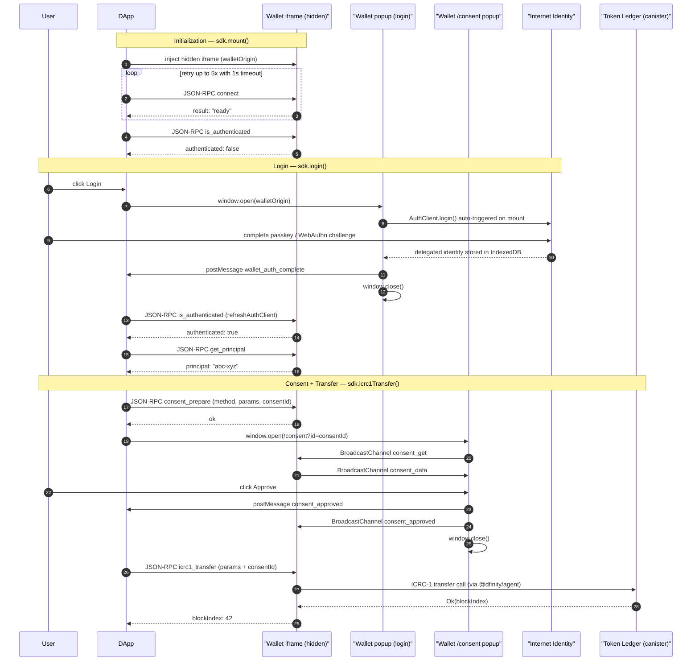

# @cashier-wallet/wallet-sdk — Technical Reference

This document is the complete technical reference for the SDK. It covers every exported class, method, type, and error; explains the internal runtime mechanics; and shows how the DApp integration compares to the pre-SDK baseline.

For a quick-start guide see [README.md](./README.md).

---

## Table of Contents

- [Architecture Overview](#architecture-overview)
- [Exported Items](#exported-items)
  - [WalletSDK class](#walletsdk-class)
  - [RpcClient class](#rpcclient-class)
  - [Error classes](#error-classes)
  - [Types and interfaces](#types-and-interfaces)
- [Before / After: Migration from Manual Integration](#before--after-migration-from-manual-integration)
- [Internal Mechanics](#internal-mechanics)
  - [Dual-channel design](#dual-channel-design)
  - [Two-phase consent protocol](#two-phase-consent-protocol)
  - [IndexedDB session sharing](#indexeddb-session-sharing)
  - [Handshake retry loop](#handshake-retry-loop)
  - [Security properties](#security-properties)

---

## Architecture Overview

The SDK acts as a secure bridge between a DApp page and a hosted wallet application. The DApp never holds private keys — all identity management, signing, and ledger calls happen exclusively inside the wallet origin.

At runtime two communication paths exist simultaneously:

```
DApp page
  │
  │  postMessage (JSON-RPC 2.0)
  ▼
Wallet hidden iframe  (rpc-handler.ts — always running)
  │                        │
  │ BroadcastChannel       │ postMessage (consent_approved / rejected)
  ▼                        ▼
Wallet /consent popup ──▶  DApp page (SDK listener)
  │
  ▼
User sees approve / reject UI (wallet origin — cannot be spoofed)
```

### Full flow sequence diagram



---

## Exported Items

### `WalletSDK` class

The primary entry point. One instance per page is the normal pattern.

```typescript
import { WalletSDK } from "@cashier-wallet/wallet-sdk";
```

#### Constructor

```typescript
new WalletSDK(config?: WalletSDKConfig)
```

| Parameter             | Type                | Default                 | Description                                                            |
| --------------------- | ------------------- | ----------------------- | ---------------------------------------------------------------------- |
| `config.walletOrigin` | `string` (optional) | `http://localhost:5177` | Full origin of the hosted wallet app. Override for staging/production. |

The constructor is synchronous. It only stores configuration — no network activity or DOM manipulation occurs until `mount()` is called.

---

#### Lifecycle methods

##### `mount(container: HTMLElement): Promise<void>`

Creates a hidden `<iframe>` pointing at `walletOrigin`, appends it to `container`, and performs the ICRC-29 handshake.

- If a previous session exists in the wallet's IndexedDB, the `authChange` event fires automatically with `authenticated: true`.
- Must be called before any other method.
- Calling `mount()` a second time is a no-op (idempotent).
- Rejects if the handshake fails after 5 retries.

```typescript
await sdk.mount(document.body);
// or mount inside a specific container element
await sdk.mount(document.getElementById("wallet-bridge")!);
```

---

##### `unmount(): void`

Removes the hidden iframe from the DOM, cancels all pending RPC requests, and removes all `postMessage` listeners. Emits the `'disconnected'` event.

Call this when the page or component that owns the SDK instance is torn down.

```typescript
// SvelteKit / Svelte
onDestroy(() => sdk.unmount());

// React
useEffect(() => {
  sdk.mount(ref.current!);
  return () => sdk.unmount();
}, []);
```

---

#### Auth methods

##### `login(): Promise<{ principal: string }>`

Opens the wallet in a popup window. The wallet auto-triggers Internet Identity on mount. Resolves with the authenticated principal once the user completes login.

- Does **not** require `mount()` to have been called first, but `mount()` must complete before the session state is refreshed.
- Throws `Error('WalletSDK: login popup was blocked')` if the browser blocks the popup (typically because it was not triggered directly from a user gesture).

```typescript
const { principal } = await sdk.login();
console.log("Logged in as", principal);
```

---

##### `logout(): Promise<void>`

Clears the session in the wallet's IndexedDB (via the hidden iframe). Emits `authChange` with `{ authenticated: false, principal: '' }`.

```typescript
await sdk.logout();
```

---

##### `isAuthenticated(): Promise<boolean>`

Queries the hidden iframe for the current session status without any UI interaction.

- Requires `mount()` to have completed.
- Throws `NotConnectedError` if `mount()` has not been called.

```typescript
const ok = await sdk.isAuthenticated();
```

---

#### Wallet operation methods

All methods in this section:

- Require `mount()` to have completed.
- Throw `NotConnectedError` if the SDK is not connected.
- Open a wallet consent popup before executing the operation. The user must click **Approve** in the popup.
- Throw `UserRejectedError` (code 4001) if the user clicks Reject.
- Throw `ConsentTimeoutError` (code 4002) if the user closes the consent popup without making a decision.

---

##### `getPrincipal(): Promise<string>`

Returns the authenticated principal as a text string. Requires consent.

```typescript
const principal = await sdk.getPrincipal();
// "rdmx6-jaaaa-aaaaa-aaadq-cai"
```

---

##### `signMessage(message: string): Promise<SignResult>`

Signs an arbitrary UTF-8 message with the user's delegated identity. Returns the hex-encoded signature and the principal. Requires consent.

```typescript
const { signature, principal } = await sdk.signMessage("hello world");
```

| Return field | Type     | Description                       |
| ------------ | -------- | --------------------------------- |
| `signature`  | `string` | Hex-encoded signature bytes       |
| `principal`  | `string` | Principal of the signing identity |

---

##### `icrc1BalanceOf(canisterId: string, owner?: string): Promise<bigint>`

Queries the ICRC-1 token balance for the given canister. `owner` defaults to the authenticated principal if omitted. Requires consent.

```typescript
const balance = await sdk.icrc1BalanceOf("ryjl3-tyaaa-aaaaa-aaaba-cai");
// 10_000_000n  (e8s)
```

| Parameter    | Type                | Description                                        |
| ------------ | ------------------- | -------------------------------------------------- |
| `canisterId` | `string`            | ICRC-1 token ledger canister ID                    |
| `owner`      | `string` (optional) | Principal to query; defaults to authenticated user |

---

##### `icrc1Transfer(params: TransferParams): Promise<TransferResult>`

Executes an on-chain ICRC-1 token transfer. Requires consent.

```typescript
const { blockIndex } = await sdk.icrc1Transfer({
  canisterId: "ryjl3-tyaaa-aaaaa-aaaba-cai",
  to: "aaaaa-aa",
  amount: BigInt(10_000), // 0.0001 ICP in e8s
});
console.log("Block index:", blockIndex);
```

`TransferParams`:

| Field        | Type     | Description                                            |
| ------------ | -------- | ------------------------------------------------------ |
| `canisterId` | `string` | ICRC-1 token ledger canister ID                        |
| `to`         | `string` | Recipient principal as text                            |
| `amount`     | `bigint` | Amount in the token's smallest unit (e.g. e8s for ICP) |

`TransferResult`:

| Field        | Type     | Description                           |
| ------------ | -------- | ------------------------------------- |
| `blockIndex` | `bigint` | Block height of the accepted transfer |

---

##### `ping(): Promise<string>`

Health check — sends a `ping` RPC to the hidden iframe and returns `"pong"`. No consent required. Useful for verifying the connection is alive.

```typescript
const pong = await sdk.ping(); // "pong"
```

---

#### Event methods

##### `on<K>(event: K, listener: (data: WalletSDKEvents[K]) => void): this`

Register a listener for an SDK event. Returns `this` for chaining.

```typescript
sdk
  .on("authChange", ({ authenticated, principal }) => {
    console.log(authenticated ? `Logged in as ${principal}` : "Logged out");
  })
  .on("connected", () => console.log("Wallet bridge ready"))
  .on("disconnected", () => console.log("Wallet bridge torn down"));
```

---

##### `off<K>(event: K, listener: (data: WalletSDKEvents[K]) => void): this`

Remove a previously registered listener.

```typescript
sdk.off("authChange", myHandler);
```

---

### `RpcClient` class

Low-level JSON-RPC 2.0 client over `postMessage`. `WalletSDK` uses this internally. It is exported for advanced use cases (e.g. building a custom SDK layer or sending proprietary RPC methods directly).

```typescript
import { RpcClient } from "@cashier-wallet/wallet-sdk";
```

#### Constructor

```typescript
new RpcClient(targetOrigin: string)
```

Registers a `window.message` listener scoped to `targetOrigin`. Does not send any messages.

---

#### `connect(target: Window): void`

Sets the target window to send messages to. Call this after the iframe or popup has loaded.

```typescript
const client = new RpcClient("http://localhost:5177");
client.connect(iframe.contentWindow!);
```

---

#### `request(method: string, params?: unknown, timeoutMs?: number): Promise<unknown>`

Sends a JSON-RPC 2.0 request and returns a promise that resolves with the `result` field, or rejects with a `WalletError` if the response contains an `error` field.

| Parameter   | Type      | Default     | Description                                                      |
| ----------- | --------- | ----------- | ---------------------------------------------------------------- |
| `method`    | `string`  | —           | RPC method name                                                  |
| `params`    | `unknown` | `undefined` | Optional params object                                           |
| `timeoutMs` | `number`  | `15000`     | Milliseconds before the request is rejected with a timeout error |

---

#### `destroy(): void`

Removes the `message` listener and rejects all pending requests. Must be called when the client is no longer needed to prevent memory leaks.

---

### Error classes

All errors extend `WalletError`, which itself extends `Error`. Every error instance exposes a numeric `code` property matching the relevant EIP-1193 / JSON-RPC convention.

```typescript
import {
  WalletError,
  UserRejectedError,
  NotAuthenticatedError,
  MethodNotFoundError,
  NotConnectedError,
  ConsentTimeoutError,
} from "@cashier-wallet/wallet-sdk";
```

| Class                   | Code     | When thrown                                                      |
| ----------------------- | -------- | ---------------------------------------------------------------- |
| `WalletError`           | varies   | Base class — catch this to handle any SDK error                  |
| `UserRejectedError`     | `4001`   | User clicked Reject in the consent popup                         |
| `NotAuthenticatedError` | `4100`   | Wallet requires login before this method can run                 |
| `MethodNotFoundError`   | `-32601` | The wallet does not recognise the requested RPC method           |
| `NotConnectedError`     | `-1`     | `mount()` has not been called or the iframe is not yet connected |
| `ConsentTimeoutError`   | `4002`   | The consent popup was closed without a decision                  |

Typical error handling pattern:

```typescript
import {
  UserRejectedError,
  ConsentTimeoutError,
  NotConnectedError,
} from '@cashier-wallet/wallet-sdk'

try {
  await sdk.icrc1Transfer({ ... })
} catch (e) {
  if (e instanceof UserRejectedError) {
    // user cancelled — do nothing
  } else if (e instanceof ConsentTimeoutError) {
    // popup was closed — prompt to try again
  } else if (e instanceof NotConnectedError) {
    // sdk.mount() was not called
  } else {
    // unexpected error
    throw e
  }
}
```

---

### Types and interfaces

All types are re-exported from the package root and can be imported with `import type`.

```typescript
import type {
  WalletSDKConfig,
  WalletSDKEvents,
  AuthState,
  SignResult,
  TransferParams,
  TransferResult,
  ConnectInfo,
  RpcRequest,
  RpcResponse,
  RpcError,
  ConsentChannelMessage,
} from "@cashier-wallet/wallet-sdk";
```

---

#### `WalletSDKConfig`

Constructor options.

```typescript
interface WalletSDKConfig {
  walletOrigin?: string; // default: "http://localhost:5177"
}
```

---

#### `WalletSDKEvents`

Event map used by `on()` and `off()`. The key is the event name; the value is the payload type.

```typescript
interface WalletSDKEvents {
  connected: undefined; // ICRC-29 handshake succeeded
  disconnected: undefined; // sdk.unmount() was called
  authChange: AuthState; // session state changed (login or logout)
}
```

---

#### `AuthState`

Payload of the `authChange` event.

```typescript
interface AuthState {
  authenticated: boolean;
  principal: string; // empty string when authenticated is false
}
```

---

#### `SignResult`

Return type of `signMessage()`.

```typescript
interface SignResult {
  signature: string; // hex-encoded signature
  principal: string; // text representation of the signing principal
}
```

---

#### `TransferParams`

Input to `icrc1Transfer()`.

```typescript
interface TransferParams {
  canisterId: string; // ICRC-1 ledger canister ID
  to: string; // recipient principal as text
  amount: bigint; // amount in smallest token unit (e8s for ICP)
}
```

---

#### `TransferResult`

Return type of `icrc1Transfer()`.

```typescript
interface TransferResult {
  blockIndex: bigint; // block height of the accepted transfer
}
```

---

#### `ConnectInfo`

Informational shape returned by the wallet on a successful `connect` handshake (internal use).

```typescript
interface ConnectInfo {
  status: string;
  walletOrigin: string;
  version: string;
}
```

---

#### `RpcRequest` / `RpcResponse` / `RpcError`

JSON-RPC 2.0 wire types used internally by `RpcClient`. Exposed for integrators who need to type-check raw messages.

```typescript
interface RpcRequest {
  jsonrpc: "2.0";
  id: string;
  method: string;
  params?: unknown;
}

interface RpcResponse {
  jsonrpc: "2.0";
  id: string;
  result?: unknown;
  error?: RpcError;
}

interface RpcError {
  code: number;
  message: string;
}
```

---

#### `ConsentChannelMessage`

Union type for all messages exchanged over the `BroadcastChannel('wallet-consent')` between the hidden iframe and the consent popup. Not needed for normal SDK consumers — useful if you are building wallet-side tooling.

```typescript
type ConsentChannelMessage =
  | ConsentGetMessage // popup → iframe: "send me the data for this consentId"
  | ConsentDataMessage // iframe → popup: operation details
  | ConsentApprovedMessage // popup → iframe: user approved
  | ConsentRejectedMessage; // popup → iframe: user rejected

interface ConsentGetMessage {
  type: "consent_get";
  consentId: string;
}
interface ConsentDataMessage {
  type: "consent_data";
  consentId: string;
  method: string;
  params: unknown;
}
interface ConsentApprovedMessage {
  type: "consent_approved";
  consentId: string;
}
interface ConsentRejectedMessage {
  type: "consent_rejected";
  consentId: string;
}
```

---

## Before / After: Migration from Manual Integration

### What existed before the SDK

Before `@cashier-wallet/wallet-sdk` was created, the DApp owned all wallet integration code directly. This code lived in four files inside `apps/dapp/src/lib/`:

| File                  | Lines | Responsibility                                                    |
| --------------------- | ----- | ----------------------------------------------------------------- |
| `wallet-bridge.ts`    | ~200  | iframe injection, ICRC-29 handshake, auth state, popup management |
| `rpc-client.ts`       | ~90   | JSON-RPC 2.0 client (pending map, timeout, origin filter)         |
| `consent-store.ts`    | ~40   | Svelte `writable` store tracking pending consent queue            |
| `ConsentModal.svelte` | ~80   | DApp-rendered approve/reject overlay                              |

The DApp also had direct dependencies on `@dfinity/agent` and `@dfinity/principal` to construct principal objects and parse RPC responses.

**Critical security problem:** consent was rendered entirely by the DApp's own UI (`ConsentModal.svelte`). A compromised or malicious DApp could auto-approve transactions, skip the modal, or display misleading operation details — the user had no way to verify they were looking at wallet-controlled UI.

---

### Initialization

**Before — DApp owned the iframe setup:**

```typescript
// apps/dapp/src/lib/wallet-bridge.ts  (deleted)
export async function mountWallet(container: HTMLElement) {
  const iframe = document.createElement("iframe");
  iframe.src = WALLET_ORIGIN;
  iframe.style.cssText = "position:absolute;width:0;height:0;border:0;";

  await new Promise<void>((resolve, reject) => {
    iframe.addEventListener("load", async () => {
      rpcClient.connect(iframe.contentWindow!);
      for (let i = 0; i < 5; i++) {
        try {
          await rpcClient.request("connect", undefined, 1000);
          resolve();
          return;
        } catch {
          /* retry */
        }
      }
      reject(new Error("handshake failed"));
    });
    container.appendChild(iframe);
  });
}

// apps/dapp/src/lib/rpc-client.ts  (deleted)
export const rpcClient = new RpcClient(WALLET_ORIGIN); // ~90 lines of boilerplate

// +page.svelte  (before)
import { mountWallet } from "$lib/wallet-bridge";
import { rpcClient } from "$lib/rpc-client";
import { PUBLIC_WALLET_ORIGIN } from "$env/static/public";

onMount(async () => {
  await mountWallet(bridgeContainer);
  // ...manual auth state tracking...
});
```

**After — three lines:**

```typescript
// +page.svelte  (now)
import { WalletSDK } from "@cashier-wallet/wallet-sdk";

const sdk = new WalletSDK(); // walletOrigin defaults to localhost:5177

onMount(async () => {
  sdk.on("authChange", ({ authenticated, principal }) => {
    /* update UI */
  });
  await sdk.mount(bridgeContainer);
});
onDestroy(() => sdk.unmount());
```

---

### Login

**Before — manual popup + postMessage listener:**

```typescript
// apps/dapp/src/lib/wallet-bridge.ts  (deleted)
export async function login(): Promise<string> {
  const tab = window.open(PUBLIC_WALLET_ORIGIN, "_blank");
  if (!tab) throw new Error("popup blocked");

  return new Promise((resolve) => {
    window.addEventListener("message", function handler(e) {
      if (e.origin !== PUBLIC_WALLET_ORIGIN) return;
      if (e.data?.type !== "wallet_auth_complete") return;
      window.removeEventListener("message", handler);
      resolve(e.data.principal);
    });
  });
  // then separately call rpcClient.request('is_authenticated')
  // then call rpcClient.request('get_principal')
  // then update local state...
}
```

**After — one call:**

```typescript
const { principal } = await sdk.login();
// authChange event fires automatically; no manual postMessage wiring
```

---

### Token transfer with consent

**Before — DApp-side consent (security risk):**

```typescript
// apps/dapp/src/lib/consent-store.ts  (deleted)
// Svelte-specific writable store; only worked in Svelte apps
import { writable } from "svelte/store";
export const pendingConsent = writable<ConsentRequest | null>(null);

// +page.svelte  (before) — DApp rendered the modal
// ConsentModal.svelte was a DApp component; could be bypassed by DApp code
import ConsentModal from "$lib/ConsentModal.svelte";

// To transfer, the DApp would:
// 1. Show ConsentModal (DApp-controlled — spoofable)
// 2. On approve, manually call rpcClient.request('icrc1_transfer', params)
// 3. Parse the bigint response manually
// The user had no way to know if the modal was genuine
```

**After — wallet-controlled consent popup:**

```typescript
// Single method call — consent runs inside the wallet origin
const { blockIndex } = await sdk.icrc1Transfer({
  canisterId: "ryjl3-tyaaa-aaaaa-aaaba-cai",
  to: recipientPrincipal,
  amount: BigInt(10_000),
});
// The consent UI was rendered at walletOrigin/consent — the DApp cannot
// tamper with it, and the browser URL bar shows the wallet's origin
```

---

### Dependency footprint comparison

|                                     | Before                                      | After                            |
| ----------------------------------- | ------------------------------------------- | -------------------------------- |
| Files in DApp `src/lib/`            | 4 wallet files (400+ lines)                 | 0                                |
| Direct `@dfinity/*` imports in DApp | `@dfinity/agent`, `@dfinity/principal`      | None                             |
| Framework coupling                  | Svelte stores (`writable`) in consent logic | None — pure TypeScript           |
| Consent security                    | DApp-rendered UI (spoofable)                | Wallet-origin popup (unfakeable) |

---

## Internal Mechanics

### Dual-channel design

The SDK uses two independent messaging channels:

| Channel                              | Direction              | Purpose                                                 |
| ------------------------------------ | ---------------------- | ------------------------------------------------------- |
| `window.postMessage`                 | DApp ↔ wallet iframe   | All JSON-RPC 2.0 method calls and responses             |
| `BroadcastChannel('wallet-consent')` | iframe ↔ consent popup | Consent data fetch and approval/rejection notifications |

The `BroadcastChannel` is only accessible to pages running at the same origin as the wallet. The DApp cannot read or write to it. This is what prevents a compromised DApp from forging a consent approval — the iframe only executes the sensitive RPC after receiving `consent_approved` on the `BroadcastChannel`, not on `postMessage`.

When the user approves, the consent popup sends both:

1. `BroadcastChannel` → `consent_approved` to the iframe (authorises actual execution)
2. `window.opener.postMessage` → `consent_approved` to the DApp (unblocks the pending SDK promise)

The actual RPC only executes after **both** signals arrive in the correct order: the popup closes, the DApp sends the final RPC with the `consentId`, and the iframe validates that `consentId` against its internal approval map before proceeding.

---

### Two-phase consent protocol

Every sensitive method (`getPrincipal`, `signMessage`, `icrc1BalanceOf`, `icrc1Transfer`) goes through this protocol inside `WalletSDK._requestWithConsent()`:

```
Phase 1 — Register
  DApp generates consentId = crypto.randomUUID()
  DApp → iframe: JSON-RPC consent_prepare { method, params, consentId }
  iframe stores { consentId → { method, params, resolve, reject } } in pendingConsents Map

Phase 2 — User decision
  DApp opens wallet/consent?id=<consentId> as a popup (460×520, no scrollbars)
  Popup → iframe: BroadcastChannel consent_get { consentId }
  iframe → Popup: BroadcastChannel consent_data { method, params }
  User reads the details in the popup (wallet-origin UI)
  User clicks Approve or Reject

Phase 3 — Execute or abort
  If Approve:
    Popup → iframe: BroadcastChannel consent_approved { consentId }
    Popup → DApp:  postMessage consent_approved { consentId }
    DApp → iframe: JSON-RPC <method> { ...params, consentId }
    iframe validates consentId in approvals Map, executes, responds
  If Reject:
    Popup → iframe: BroadcastChannel consent_rejected { consentId }
    Popup → DApp:  postMessage consent_rejected { consentId }
    DApp SDK throws UserRejectedError(4001)
```

Methods that bypass consent (`ping`, `connect`, `is_authenticated`) are listed in `CONSENT_BYPASS` and go directly to the iframe without phases 1–2.

---

### IndexedDB session sharing

The wallet uses `@dfinity/auth-client` to manage the Internet Identity session. Auth-client persists the delegation chain in the browser's **IndexedDB**, keyed to the wallet origin.

Both the hidden iframe and the login popup run at the same origin (`walletOrigin`) and therefore share the same IndexedDB. However, they are separate browsing contexts with separate in-memory JavaScript heaps. After the login popup writes the session to IndexedDB and closes, the iframe's in-memory `AuthClient` instance does not automatically pick up the new session.

The `_refreshAuth()` method solves this by sending an `is_authenticated` RPC to the iframe. The wallet's `rpc-handler` calls `refreshAuthClient()` which creates a fresh `AuthClient.create()` call, re-reading IndexedDB. The response reflects the session just written by the popup.

```
Login popup writes delegation → IndexedDB (walletOrigin)
         ↓
DApp SDK calls _refreshAuth()
         ↓
RPC is_authenticated → iframe calls AuthClient.create() → reads IndexedDB
         ↓
Response: authenticated: true  ✓
```

---

### Handshake retry loop

When the SDK injects the hidden iframe, it waits for the `load` event and immediately sends the `connect` RPC. However, SvelteKit (the wallet's framework) has a hydration delay — the `rpc-handler` message listener is only registered after the Svelte component mounts and `onMount` runs, which is always after the raw `load` event fires.

To bridge this race, `mount()` retries the handshake up to `HANDSHAKE_RETRIES = 5` times with a `HANDSHAKE_TIMEOUT_MS = 1000` ms timeout per attempt. In practice the second attempt almost always succeeds.

```typescript
for (let i = 0; i < HANDSHAKE_RETRIES; i++) {
  try {
    await client.request("connect", undefined, HANDSHAKE_TIMEOUT_MS);
    break; // success
  } catch {
    // timeout — try again
  }
}
```

---

### Security properties

| Property                               | Mechanism                                                                                                                             |
| -------------------------------------- | ------------------------------------------------------------------------------------------------------------------------------------- |
| Private keys never leave wallet origin | All signing happens inside the iframe or popup; only the result (signature / block index) crosses `postMessage`                       |
| Consent UI cannot be spoofed by DApp   | Consent popup runs at `walletOrigin` — the browser URL bar shows this; the DApp has no access to the popup's DOM                      |
| BroadcastChannel isolation             | `BroadcastChannel('wallet-consent')` is accessible only to same-origin pages; DApp cannot send or intercept messages on it            |
| Origin-pinned postMessage              | `RpcClient` validates `event.origin === targetOrigin` on every incoming message; responses from any other origin are silently dropped |
| Unique per-operation consentId         | `crypto.randomUUID()` per call prevents replay — an old approval cannot be reused for a different operation                           |
| iframe popup blocked detection         | If `window.open()` returns `null`, the SDK throws immediately rather than silently hanging                                            |
| Popup closed without decision          | A `setInterval` poll detects `popup.closed === true` and rejects with `ConsentTimeoutError` so the promise does not hang indefinitely |
