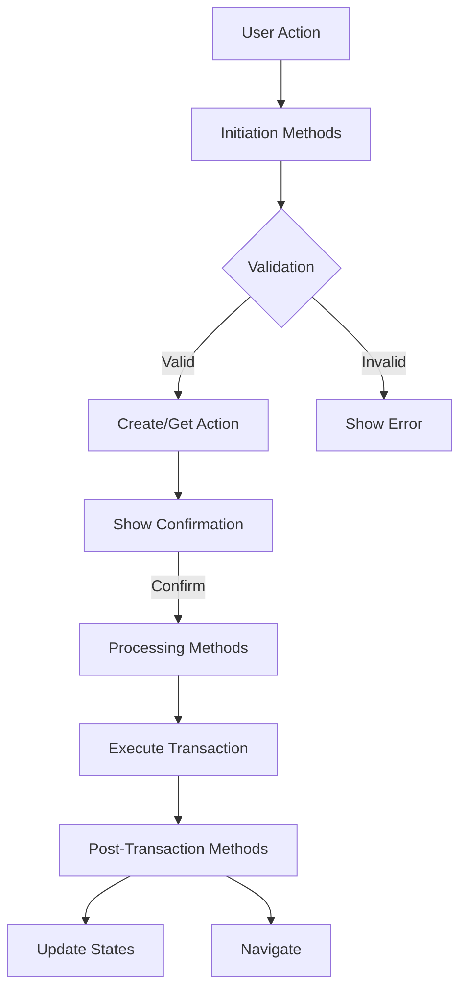

# Action Handling Methods Documentation

This document describes the key action handling methods used in the LinkPreview, ChooseWallet, and Details pages components.

## Common Props in ConfirmationDrawerV2

### `handleSuccessContinue: () => Promise<void>`

The callback function that is called after a successful transaction to continue the workflow. Each component implements this differently based on the next step in their workflow:

- **LinkPreview**: Sets the link to active state
- **ChooseWallet**: Updates link user state and navigates to complete page
- **Details**: Sets the link to inactive state after withdrawal

### `handleConfirmTransaction: () => Promise<void>`

The main function that handles the transaction process. Each component implements this for their specific use case:

- **LinkPreview**: Handles link creation transaction
  - Validates the link
  - Processes the action
  - Executes ICRC-112 transactions
  - Updates action state

- **ChooseWallet**: Handles link usage/claiming transaction
  - Processes the use action
  - Executes ICRC-1 12transactions for authenticated/anonymous users
  - Updates action state
  - Refreshes link user state

- **Details**: Handles withdrawal transaction
  - Processes withdrawal action
  - Executes ICRC-112 transactions
  - Updates action state
  - Sets processing state for polling

### `onActionResult: (action: ActionModel) => void`

Callback function to handle updates to the action state. Used to:

- Update local action state
- Trigger UI updates
- Handle state changes in the parent component

## Component-Specific Implementations

### LinkPreview Component

```typescript
handleSuccessContinue: async () => {
  // Sets the link to ACTIVE state after successful creation
  // Redirects to details page if successful
  await handleSetLinkToActive();
};

handleConfirmTransaction: async () => {
  // Validates and processes link creation
  // Executes token transactions
  // Updates action state
  await handleConfirmTransaction();
};

onActionResult: (action: ActionModel) => {
  // Updates the local action state
  setAction(action);
};
```

### ChooseWallet Component

```typescript
handleSuccessContinue: async () => {
  // Updates link user state
  // Refreshes link details
  // Navigates to complete page if state is COMPLETE
  await handleUpdateLinkUserState();
};

handleConfirmTransaction: async () => {
  // Handles the entire claiming process
  // Manages processing state
  // Refreshes data after completion
  await startTransaction();
};

onActionResult: (action: ActionModel) => {
  // Passed through to parent for state management
  // Used to update UI based on action state
};
```

### Details Component

```typescript
handleSuccessContinue: async () => {
  // Sets link to inactive after successful withdrawal
  // Updates UI state
  await setInactiveEndedLink();
};

handleConfirmTransaction: async () => {
  // Processes withdrawal
  // Handles transaction execution
  // Manages polling for updates
  await handleWithdrawProcess();
};

onActionResult: (action: ActionModel) => {
  // Updates local action state
  // Used for UI updates during withdrawal process
  handleActionResult(action);
};
```

## Common Patterns

1. **Error Handling**
   - All methods include try-catch blocks
   - Use onCashierError for error notifications
   - Clean up states in finally blocks

2. **State Management**
   - Update loading/processing states
   - Refresh data after successful operations
   - Handle UI updates based on state changes

3. **Data Refresh**
   - Use enhancedRefresh for comprehensive updates
   - Multiple refetch calls to ensure data consistency
   - Polling for real-time updates during processing

## Action Methods Overview

### 1. Action Initiation Methods

These methods handle the initial validation and action creation:

```typescript
// LinkPreview Component
initiateCreateLinkAction(): Promise<void>
- Validates balance with creation fee
- Creates action for new links
- Shows confirmation drawer

// ChooseWallet Component
initiateUseLinkAction(anonymousWalletAddress?: string): Promise<void>
- Validates for receive-type links
- Creates action for anonymous/authenticated users
- Shows confirmation drawer

// DetailPage Component
initiateWithdrawAction(): Promise<void>
- Validates link existence
- Creates withdrawal action
- Shows confirmation drawer
```

### 2. Transaction Processing Methods

These methods handle the actual transaction execution:

```typescript
// LinkPreview Component
handleConfirmTransaction(): Promise<void>
- Processes action
- Executes ICRC-112 transactions
- Updates action state

// ChooseWallet Component
startTransaction(): Promise<void>
- Processes use action
- Executes ICRC-112 transactions
- Updates link user state

// DetailPage Component
handleWithdrawProcess(): Promise<void>
- Processes withdrawal
- Executes ICRC-112 transactions
- Manages polling for updates
```

### 3. Post-Transaction Methods

These methods handle state updates after successful transactions:

```typescript
// LinkPreview Component
handleSetLinkToActive(): Promise<void>
- Updates link state to ACTIVE
- Redirects to details page
- Refreshes link details

// ChooseWallet Component
handleUpdateLinkUserState(): Promise<void>
- Updates link user state
- Refreshes link details
- Navigates to complete page

// DetailPage Component
setInactiveEndedLink(): Promise<void>
- Sets link to inactive
- Updates UI state
- Refreshes link details
```

### Method Flow Chart



### Method Groups by Component

1. **LinkPreview Component**
   - **Initiation**: `initiateCreateLinkAction`
   - **Processing**: `handleConfirmTransaction`
   - **Post-Transaction**: `handleSetLinkToActive`

2. **ChooseWallet Component**
   - **Initiation**: `initiateUseLinkAction`
   - **Processing**: `startTransaction`
   - **Post-Transaction**: `handleUpdateLinkUserState`

3. **DetailPage Component**
   - **Initiation**: `initiateWithdrawAction`
   - **Processing**: `handleWithdrawProcess`
   - **Post-Transaction**: `setInactiveEndedLink`

### Common Supporting Methods

```typescript
// Action Creation
createAction(linkId: string, actionType: ACTION_TYPE): Promise<ActionModel>
handleCreateActionForUser(): Promise<ActionModel>
handleCreateActionAnonymous(walletAddress: string): Promise<ActionModel>

// Validation
validateLinkPreviewWithBalance(link: LinkModel, options: ValidationOptions)
validateAssetAndFees(link: LinkModel)
validateBeforeAction(link: LinkModel)

// State Management
setAction(action: ActionModel)
setShowConfirmation(show: boolean)
setIsProcessing(processing: boolean)
```

### Method Dependencies

Each action flow typically requires:

1. **Validation Services**
   - `ValidationService`
   - `useLinkCreateValidation`
   - `useLinkUsageValidation`

2. **Action Services**
   - `useProcessAction`
   - `useUpdateAction`
   - `useIcrc112Execute`

3. **State Management**
   - `useLinkAction`
   - `useLinkUseNavigation`
   - `useIdentity`

### Error Handling Integration

Each method group includes:

```typescript
try {
  // Method implementation
} catch (error) {
  if (isCashierError(error)) {
    onCashierError(error);
  }
} finally {
  // Cleanup states
  setIsProcessing(false);
  setIsDisabled(false);
}
```

## Best Practices

1. **Validation**
   - Always validate prerequisites before transactions
   - Check for required data (link, action, etc.)
   - Validate balances for send-type links

2. **State Updates**
   - Use setAction to keep local state in sync
   - Update UI states (loading, processing, etc.)
   - Handle both success and error cases

3. **Clean Up**
   - Clear intervals and timeouts
   - Reset UI states
   - Handle incomplete transactions

4. **Data Consistency**
   - Multiple refetch calls when needed
   - Use polling for real-time updates
   - Verify state changes after transactions
