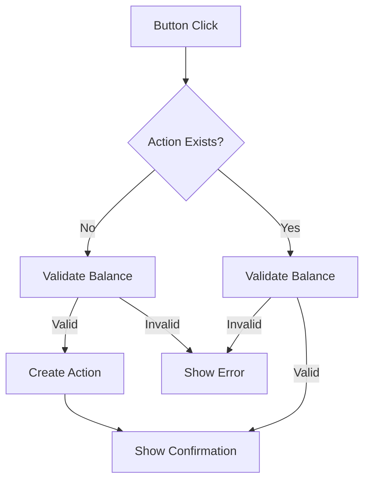

# Form Hooks and Validation System Guide

## Table of Contents

1. [Overview](#overview)
2. [Form Validation Hooks](#form-validation-hooks)
3. [Submission Handler Hooks](#submission-handler-hooks)
4. [Token Amount Checking by Page](#token-amount-checking-by-page)
5. [Usage Examples](#usage-examples)
6. [Best Practices](#best-practices)
7. [Error Handling](#error-handling)

## Overview

The Cashier frontend uses a unified validation system built around centralized hooks that provide consistent validation, error handling, and form submission across all components. The system is designed with the following principles:

-   **Centralized Logic**: All validation logic is consolidated in `ValidationService`
-   **Template-based Errors**: Error messages use translation templates with dynamic variables
-   **O(1) Performance**: Token lookups use hash maps for optimal performance
-   **Type Safety**: Full TypeScript support with proper error codes
-   **Consistent API**: Unified interface across all form types

## Form Validation Hooks

### useLinkCreateValidation

**Location**: `/src/hooks/form/useLinkCreateValidation.ts`

**Purpose**: Handles validation for LinkPreview component with balance checking capabilities.

**Key Methods**:

-   `validateLinkPreview(link)` - Basic link existence and type validation
-   `validateBalanceWithCreationFee(link, maxActionNumber, includeLinkCreationFee)` - Balance validation with fee control
-   `validateLinkPreviewWithBalance(link, options)` - Combined validation with balance checking
-   `validateActionCreation(link)` - Simplified action creation validation
-   `showValidationErrorToast(errors)` - Display validation errors as toast notifications

**Features**:

-   Unified ValidationService integration
-   Template-based error message translation
-   Configurable link creation fee inclusion
-   Automatic toast notifications for errors

```typescript
const { validateLinkPreviewWithBalance } = useLinkCreateValidation();

const validationResult = validateLinkPreviewWithBalance(link, {
    maxActionNumber: BigInt(1),
    includeLinkCreationFee: true,
});

if (!validationResult.isValid) {
    // Errors automatically shown as toast notifications
    return;
}
```

### useLinkTemplateValidation

**Location**: `/src/hooks/form/useLinkTemplateValidation.ts`

**Purpose**: Centralized validation for LinkTemplate component with state management.

**Key Methods**:

-   `validateLinkTemplate(currentLink, carouselIndex)` - Template form validation
-   `isLinkTypeSupported(linkType)` - Check if link type is supported
-   `clearValidationErrors()` - Clear all validation state
-   `showValidationError(errorType)` - Show specific validation errors
-   `getValidationMessage(errorType)` - Get validation messages for display

**Features**:

-   Centralized validation state management
-   Automatic error clearing on user interaction
-   Type-safe validation methods
-   Toast notifications for validation errors

```typescript
const { validationState, validateLinkTemplate, clearValidationError } = useLinkTemplateValidation();

const result = validateLinkTemplate(currentLink, carouselIndex);
if (!result.isValid) {
    // Errors automatically displayed via toast
    return;
}
```

## Submission Handler Hooks

### useSubmissionHandler

**Location**: `/src/hooks/form/useSubmissionHandler.ts`

**Purpose**: Core submission logic for different submission contexts.

**Key Methods**:

-   `handleFormSubmission(context)` - Form validation and submission
-   `handleLinkCreation(context)` - Link creation submission logic
-   `handleTemplateSubmission(context)` - Template submission logic

**Context Types**:

-   `FormSubmissionContext` - For form submissions with validation
-   `LinkCreationContext` - For link creation/preview submissions
-   `TemplateSubmissionContext` - For template submissions

### usePageSubmissionHandlers

**Location**: `/src/hooks/form/usePageSubmissionHandlers.ts`

**Purpose**: Page-specific submission handlers that wrap the core submission logic.

**Available Handlers**:

-   `useFormSubmissionHandler()` - Generic form submission
-   `useLinkCreationHandler()` - Link creation/preview
-   `useLinkTemplateHandler()` - Template handling
-   `useSendTipFormHandler()` - Send tip form specific
-   `useSendAirdropFormHandler()` - Send airdrop form specific
-   `useSendTokenBasketFormHandler()` - Send token basket form specific
-   `useReceivePaymentFormHandler()` - Receive payment form specific

```typescript
const { submitTipForm } = useSendTipFormHandler();

await submitTipForm(linkId, formAssets, maxActionNumber, errorHandler);
```

## Token Amount Checking by Page

| Page/Component          | Hook Used                       | Validation Type    | Balance Check | Fee Calculation          | Link Creation Fee | Error Message Template                      |
| ----------------------- | ------------------------------- | ------------------ | ------------- | ------------------------ | ----------------- | ------------------------------------------- |
| **SendTipForm**         | `useSendTipFormHandler`         | Form Submission    | ✅ Required   | Network + Asset          | ❌ Not included   | `error.balance.insufficient_balance`        |
| **SendAirdropForm**     | `useSendAirdropFormHandler`     | Form Submission    | ✅ Required   | Network + Asset × Claims | ❌ Not included   | `error.balance.insufficient_balance`        |
| **SendTokenBasketForm** | `useSendTokenBasketFormHandler` | Form Submission    | ✅ Required   | Network + Asset × Uses   | ❌ Not included   | `error.balance.insufficient_balance`        |
| **ReceivePaymentForm**  | `useReceivePaymentFormHandler`  | Form Submission    | ❌ Skipped    | Not applicable           | ❌ Not included   | N/A (no balance required)                   |
| **LinkPreview**         | `useLinkCreateValidation`       | Balance + Creation | ✅ Required   | Network + Asset          | ✅ Configurable   | `error.balance.insufficient_balance_create` |
| **LinkDetails**         | Form-specific handlers          | Form Submission    | ✅ Required   | Based on link type       | ❌ Not included   | `error.balance.insufficient_balance`        |
| **AddAssetForm**        | ValidationService direct        | Asset Addition     | ✅ Required   | Network + Asset          | ❌ Not included   | `error.balance.insufficient_balance`        |

### Validation Behavior Details

#### Form Submission Validation

-   **Purpose**: Validate assets before creating/updating links
-   **Balance Check**: Ensures user has sufficient balance for asset amount + network fees
-   **Fee Calculation**: `asset.amount + networkFee` (× maxActionNumber for airdrops)
-   **Error Handling**: Form-level validation with toast notifications

#### Link Creation Validation

-   **Purpose**: Final validation before link creation in backend
-   **Balance Check**: Comprehensive validation including link creation fees
-   **Fee Calculation**: `asset.amount + networkFee + linkCreationFee`
-   **Error Handling**: Preview-level validation with detailed error messages

#### Asset Addition Validation

-   **Purpose**: Real-time validation when adding assets to forms
-   **Balance Check**: Immediate feedback on asset selection
-   **Fee Calculation**: Basic network fee calculation
-   **Error Handling**: Inline validation with immediate feedback

### Token Amount Calculation Formulas

| Scenario                    | Formula                                 | Example (1 ICP tip)                 |
| --------------------------- | --------------------------------------- | ----------------------------------- |
| **Send Tip**                | `amount + networkFee`                   | `1.0 + 0.0001 = 1.0001 ICP`         |
| **Send Airdrop (5 claims)** | `(amount + networkFee) × claims`        | `(1.0 + 0.0001) × 5 = 5.0005 ICP`   |
| **Send Token Basket**       | `amount + networkFee`                   | `1.0 + 0.0001 = 1.0001 ICP`         |
| **Link Creation**           | `amount + networkFee + linkCreationFee` | `1.0 + 0.0001 + 0.001 = 1.0011 ICP` |
| **Receive Payment**         | No validation required                  | N/A                                 |

## Usage Examples

### Basic Form Validation

```typescript
// In a form component
const { submitTipForm } = useSendTipFormHandler();

const handleSubmit = async () => {
    const formAssets = getValues("assets");

    try {
        await submitTipForm(linkId, formAssets, maxActionNumber, (error) => {
            console.error("Submission failed:", error);
            toast.error(error.message);
        });
    } catch (error) {
        // Error handling is done by the hook
    }
};
```

### Link Preview Validation

```typescript
// In LinkPreview component
const { validateLinkPreviewWithBalance } = useLinkCreateValidation();

const handleCreateAction = async () => {
    const validationResult = validateLinkPreviewWithBalance(link, {
        maxActionNumber: BigInt(maxUses),
        includeLinkCreationFee: true,
    });

    if (!validationResult.isValid) {
        // Errors automatically shown as toast
        return;
    }

    // Proceed with action creation
    await createAction();
};
```

### Template Validation

```typescript
// In LinkTemplate component
const { validateLinkTemplate, isLinkTypeSupported } = useLinkTemplateValidation();

const handleTemplateSubmit = async () => {
    const validationResult = validateLinkTemplate(currentLink, carouselIndex);

    if (!validationResult.isValid) {
        return; // Errors handled by validation system
    }

    if (!isLinkTypeSupported(currentLink.linkType)) {
        onUnsupportedType();
        return;
    }

    // Proceed with template submission
};
```

### Direct ValidationService Usage

```typescript
// For custom validation scenarios
import { ValidationService } from "@/services/validation.service";

const validateCustomAssets = (assets, tokenMap) => {
    const result = ValidationService.validateAssetsWithFees(assets, tokenMap, {
        useCase: "create",
        linkType: LINK_TYPE.SEND_TIP,
        maxActionNumber: 1,
        includeLinkCreationFee: true,
        skipBalanceCheck: false,
    });

    if (!result.isValid) {
        result.errors.forEach((error) => {
            if (error.metadata && error.message.startsWith("error.")) {
                const message = t(error.message, error.metadata);
                toast.error(message);
            }
        });
        return false;
    }

    return true;
};
```

## Best Practices

### 1. Hook Selection

-   Use page-specific handlers (`useSendTipFormHandler`) for form submissions
-   Use `useLinkCreateValidation` for preview/creation validation
-   Use `useLinkTemplateValidation` for template validation
-   Use `ValidationService` directly only for custom scenarios

### 2. Error Handling

-   Always provide error handlers to submission functions
-   Use template-based error messages for consistency
-   Let hooks handle toast notifications automatically
-   Handle validation failures gracefully

### 3. Performance Optimization

-   Use token maps (`createTokenMap()`) for O(1) lookups
-   Avoid direct token array searches
-   Cache validation results when appropriate
-   Use unified validation to avoid duplicate checks

### 4. Type Safety

-   Use proper TypeScript types for all validation functions
-   Cast link types appropriately (`link.linkType as LINK_TYPE`)
-   Leverage error codes for consistent error handling
-   Use proper context types for submission handlers

## Error Handling

### Error Codes

```typescript
enum ErrorCode {
    INSUFFICIENT_BALANCE = "INSUFFICIENT_BALANCE",
    INSUFFICIENT_BALANCE_CREATE = "INSUFFICIENT_BALANCE_CREATE",
    TOKEN_NOT_FOUND = "TOKEN_NOT_FOUND",
    NO_ASSETS_FOUND = "NO_ASSETS_FOUND",
    LINK_NOT_FOUND = "LINK_NOT_FOUND",
    FORM_VALIDATION_FAILED = "FORM_VALIDATION_FAILED",
    // ... other error codes
}
```

### Error Message Templates

```typescript
// Translation keys with metadata
"error.balance.insufficient_balance" =
    "Insufficient {{tokenSymbol}} balance. Available: {{available}}, Required: {{required}}";
"error.balance.insufficient_balance_create" =
    "Insufficient {{tokenSymbol}} balance to create link. Available: {{available}}, Required: {{required}}";
```

### Custom Error Handling

```typescript
const handleCustomError = (error: Error) => {
    if (error.message.includes("INSUFFICIENT_BALANCE")) {
        // Handle insufficient balance specifically
        showBalanceErrorDialog();
    } else {
        // Handle generic errors
        toast.error(error.message);
    }
};
```

---

## Migration Notes

If you're upgrading from the old validation system:

1. Replace direct `calculateTotalFeesForAssets` calls with hook usage
2. Update error handling to use template-based messages
3. Switch from token array searches to token maps
4. Use centralized validation hooks instead of component-specific validation
5. Update error codes to use the new ErrorCode enum

For more detailed examples and advanced usage, see the individual hook files and the `ValidationService` implementation.

## Transaction Validation and Action Creation Flow

### Asset Balance Validation

The system performs asset balance validation at two critical points:

1. **Pre-Action Creation Validation**

    - Validates sufficient balance for the transaction before creating an action
    - Includes network fees and creation fees where applicable
    - Prevents unnecessary action creation if balance is insufficient

2. **Pre-Transaction Validation**
    - Validates balance again before executing the transaction
    - Ensures balance hasn't changed between action creation and execution
    - Protects against race conditions and balance changes

### Balance Validation by Link Type

| Link Type       | What's Validated                                | When Validated               |
| --------------- | ----------------------------------------------- | ---------------------------- |
| Send Tip        | Asset amount + Network fee                      | Pre-action & Pre-transaction |
| Send Airdrop    | (Asset amount + Network fee) × Number of claims | Pre-action & Pre-transaction |
| Token Basket    | Sum of all assets + Network fees                | Pre-action & Pre-transaction |
| Receive Payment | No balance validation (receiver pays)           | N/A                          |

### Action Creation Flow

The current flow for action creation follows this pattern:

```typescript
// Current implementation
const handleCreateAction = async () => {
    // Validate balance first
    const validationResult = validateLinkPreviewWithBalance(link, {
        maxActionNumber: link.maxActionNumber,
        includeLinkCreationFee: true,
    });
    if (!validationResult.isValid) {
        return;
    }

    // Create action if validation passes
    const action = await createAction(link.id, actionType);
    setAction(action);
};
```

### Suggested Unified Flow

To make the flow more consistent, we recommend renaming methods to clearly indicate their purpose:

```typescript
// Recommended implementation
const initiateActionWithValidation = async () => {
    // Step 1: Validate balance
    const validationResult = validateLinkPreviewWithBalance(link, {
        maxActionNumber: link.maxActionNumber,
        includeLinkCreationFee: true,
    });
    if (!validationResult.isValid) {
        return;
    }

    // Step 2: Create or retrieve action
    let currentAction = action;
    if (!currentAction) {
        currentAction = await createAction(link.id, actionType);
        setAction(currentAction);
    }

    // Step 3: Show confirmation
    setShowConfirmation(true);
};
```

### Recommended Method Naming

Current methods that should be unified:

-   `handleSubmit` in LinkPreview
-   `handleCreateAction` in ChooseWallet
-   `handleWithdrawAssets` in DetailPage

Should be renamed to reflect their true purpose:

1. For Link Creation:

    ```typescript
    initiateCreateLinkAction();
    ```

2. For Link Usage:

    ```typescript
    initiateUseLinkAction();
    ```

3. For Withdrawals:
    ```typescript
    initiateWithdrawAction();
    ```

### Action State Flow



### Implementation Guidelines

1. **Button State Management**:

    ```typescript
    useEffect(() => {
        setButtonState({
            label: getActionButtonLabel(),
            isDisabled: isProcessing,
            action: initiateActionWithValidation,
        });
    }, [isProcessing, action]);
    ```

2. **Validation Service Integration**:

    ```typescript
    const validateBeforeAction = async (link: LinkModel) => {
        const validationResult = await validateAssetAndFees(link);
        if (!validationResult.isValid) {
            toast.error(validationResult.errors[0].message);
            return false;
        }
        return true;
    };
    ```

3. **Action Creation Service**:
    ```typescript
    const ensureActionExists = async (link: LinkModel) => {
        if (action) return action;
        return await createAction(link.id, determineActionType(link));
    };
    ```

This unified approach ensures:

-   Consistent validation before any action creation
-   Clear separation of validation and action creation logic
-   Predictable state management
-   Reusable validation and action creation methods
