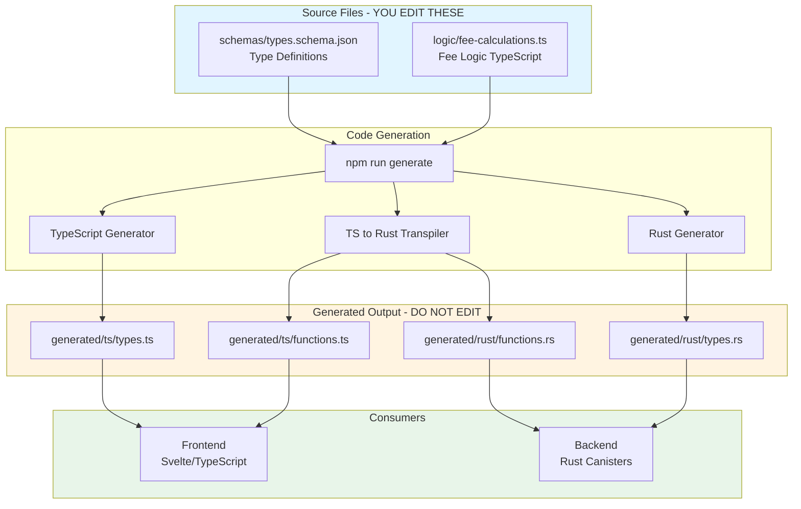

# Cashier Shared Package - Integration Guide

> **Status**: The shared package is fully functional and tested, but **not currently integrated** with the frontend or backend. This guide provides a roadmap for integration.

---

## Table of Contents

1. [Architecture Overview](#architecture-overview)
2. [How the Shared Package Works](#how-the-shared-package-works)
3. [Current Integration Status](#current-integration-status)
4. [Integration Roadmap](#integration-roadmap)
5. [Quick Start Examples](#quick-start-examples)
6. [Benefits & Trade-offs](#benefits--trade-offs)
7. [Next Steps](#next-steps)

---

## Architecture Overview

### The Problem We're Solving

The Cashier Protocol has a TypeScript frontend (Svelte/SvelteKit) and a Rust backend (canisters on the Internet Computer). Before the shared package:

- **Fee calculation logic** was duplicated in 3 places
- **Type definitions** (Intent, TokenStandard, etc.) were maintained separately
- **Changes** required manual synchronization across codebases
- **Type safety** could not be guaranteed between frontend and backend

### The Solution: Single Source of Truth



### Key Principles

1. **TypeScript as Source of Truth for Logic**: Fee calculations are written once in TypeScript and automatically transpiled to Rust
2. **JSON Schema for Types**: Type definitions use JSON Schema, which generates both TS and Rust types
3. **ICP Type Support**: Handles `Principal` and `Nat` types correctly for Internet Computer
4. **Automatic Synchronization**: One command (`npm run generate`) updates all code
5. **Type Safety Guaranteed**: Frontend and backend always have matching types

---

## How the Shared Package Works

### Step 1: Define Types (JSON Schema)

**File**: `schemas/types.schema.json`

Define enums and interfaces using JSON Schema:

```json
{
	"definitions": {
		"TokenStandard": {
			"type": "string",
			"enum": ["ICRC1", "ICRC2"],
			"description": "Token standard for ICP tokens"
		},
		"Asset": {
			"type": "object",
			"properties": {
				"address": { "type": "string", "format": "icp-principal" },
				"token_standard": { "$ref": "#/definitions/TokenStandard" }
			},
			"required": ["address", "token_standard"]
		}
	}
}
```

**Special formats for ICP types**:

- `"format": "icp-principal"` → TypeScript `Principal` / Rust `Principal`
- `"format": "icp-nat"` → TypeScript `bigint` / Rust `Nat`

### Step 2: Write Fee Logic (TypeScript)

**File**: `logic/fee-calculations.ts`

Write fee calculation logic once in TypeScript:

```typescript
export function calculateIntentTotalAmount(
	participants: IntentParticipants,
	userInputAmount: bigint = 0n,
	maxUse: number = 1,
	linkCreationFee: bigint = 0n,
	linkMaxAssetAmount: bigint = 0n,
): bigint {
	switch (participants) {
		case IntentParticipants.CreatorToTreasury:
			return linkCreationFee;
		case IntentParticipants.CreatorToLink:
			return userInputAmount * BigInt(maxUse);
		// ... other cases
	}
}
```

**Transpilation rules**:

- Keep functions simple (no complex TS features)
- Use `bigint` for amounts (becomes Rust `Nat`)
- Use `switch` statements (become Rust `match`)
- Avoid `typeof`, `??`, closures, async

### Step 3: Generate Code

```bash
cd src/shared
npm run generate
```

**What happens**:

1. **Type Generation**:
   - Reads `schemas/types.schema.json`
   - Generates `generated/ts/types.ts` (TS enums + interfaces)
   - Generates `generated/rust/types.rs` (Rust enums + structs with `CandidType`)

2. **Function Generation**:
   - Reads `logic/fee-calculations.ts`
   - Copies to `generated/ts/functions.ts` (with import path fixes)
   - Transpiles to `generated/rust/functions.rs` using AST parser

3. **Index Files**:
   - Creates `generated/ts/index.ts` (barrel exports)
   - Creates `generated/rust/mod.rs` (module exports)

4. **TypeScript Compilation**:
   - Compiles `.ts` files to `.js` files
   - Generates `.d.ts` declaration files
   - Creates source maps

### Step 4: Generated Output Examples

**TypeScript** (`generated/ts/types.ts`):

```typescript
export const TokenStandard = {
	ICRC1: 'ICRC1',
	ICRC2: 'ICRC2',
} as const;

export type TokenStandard = (typeof TokenStandard)[keyof typeof TokenStandard];

export interface Asset {
	address: Principal;
	token_standard: TokenStandard;
}
```

**Rust** (`generated/rust/types.rs`):

```rust
#[derive(CandidType, Serialize, Deserialize, Clone, Debug, PartialEq, Eq, Hash)]
pub enum TokenStandard {
    ICRC1,
    ICRC2,
}

#[derive(CandidType, Serialize, Deserialize, Clone, Debug, PartialEq)]
pub struct Asset {
    pub address: Principal,
    pub token_standard: TokenStandard,
}
```

**Rust Functions** (`generated/rust/functions.rs`):

```rust
pub fn calculate_intent_total_amount(
    participants: &IntentParticipants,
    user_input_amount: &Nat,
    max_use: u64,
    link_creation_fee: &Nat,
    link_max_asset_amount: &Nat
) -> Nat {
    match participants {
        IntentParticipants::CreatorToTreasury => {
            link_creation_fee.clone()
        }
        IntentParticipants::CreatorToLink => {
            user_input_amount.clone() * Nat::from(max_use as u64)
        }
        // ... other cases
    }
}
```

### Step 5: Testing

**TypeScript Tests**: `tests/functions.test.ts`

- 22 test cases covering all fee calculation functions
- Uses shared JSON fixtures
- All tests passing ✓

**Rust Validation**: `tests/rust-validation/`

- Cargo project that `include!`s generated Rust code
- Ensures generated code compiles with candid dependencies
- Validates function signatures and types

---

## Current Integration Status

### ✅ What's Ready

**Package Infrastructure**:

- ✅ Code generation working perfectly
- ✅ TypeScript types and functions generated
- ✅ Rust types and functions generated
- ✅ All tests passing (22/22)
- ✅ Package properly configured for npm publishing
- ✅ Documentation complete (README.md)

**Available for Frontend**:

```typescript
import {
	// Types
	IntentParticipants,
	TokenStandard,
	IntentType,
	IntentState,
	Asset,
	Intent,
	FeeCalculationInput,
	FeeCalculationResult,

	// Functions
	calculateIntentTotalAmount,
	calculateIntentTotalNetworkFee,
	calculateIntentUserFee,
	calculateIntentFees, // Convenience function
} from '@cashier/shared';
```

**Available for Backend**:

```rust
use cashier_shared::{
    // Types
    IntentParticipants,
    TokenStandard,
    Asset,
    Intent,

    // Functions
    calculate_intent_total_amount,
    calculate_intent_total_network_fee,
    calculate_intent_user_fee,
};
```

### ❌ What's NOT Being Used

**Frontend** (`src/cashier_frontend_new/`):

- ❌ Does NOT import from `@cashier/shared`
- ❌ Has custom `FeeService` with duplicate fee logic
- ❌ Uses custom types in `modules/links/types/` instead of shared types
- ❌ Maintains separate Intent, Asset, Fee type definitions

**Backend** (`src/cashier_backend/`, `src/transaction_manager/`):

- ❌ Generated Rust functions exist but are NOT imported anywhere
- ❌ Has custom fee calculation in `transaction_manager/src/utils/calculator.rs`
- ❌ Uses custom Intent types in `cashier_backend_types/src/repository/intent/v1.rs`
- ❌ Duplicates IntentTask, IntentState enums

### 📊 Duplication Analysis

| Component              | Shared Package           | Frontend               | Backend                 | Status            |
| ---------------------- | ------------------------ | ---------------------- | ----------------------- | ----------------- |
| **IntentParticipants** | ✅ Defined               | ❌ Not used            | ❌ Not used             | **Unused**        |
| **TokenStandard**      | ✅ Defined               | ❌ Not used            | ❌ Not used             | **Unused**        |
| **Fee Calculations**   | ✅ Defined (3 functions) | ❌ Custom FeeService   | ❌ Custom calculator.rs | **Duplicated 3x** |
| **Asset Type**         | ✅ Defined               | ❌ Custom Asset class  | ✅ Uses shared schema   | **Partial**       |
| **Intent Type**        | ✅ Defined               | ❌ Custom Intent class | ❌ Custom Intent struct | **Duplicated 3x** |

**Lines of duplicated code**: ~500+ lines across frontend FeeService, backend calculator, and shared package

---

## Integration Roadmap

### Phase 1: Frontend Integration

**Goal**: Replace custom FeeService with shared package functions

**Effort**: 2-3 days

**Files to Modify**:

1. **Add shared package dependency**:

   ```json
   // src/cashier_frontend_new/package.json
   {
   	"dependencies": {
   		"@cashier/shared": "workspace:*"
   	}
   }
   ```

2. **Replace FeeService** (`src/cashier_frontend_new/src/modules/shared/services/feeService.ts`):

   **Before**:

   ```typescript
   class FeeService {
   	computeAmount(input: ComputeAmountAndFeeInput): ComputeAmountAndFeeOutput {
   		// Custom fee calculation logic (~100 lines)
   	}
   }
   ```

   **After**:

   ```typescript
   import {
   	calculateIntentFees,
   	IntentParticipants,
   	TokenStandard,
   } from '@cashier/shared';

   class FeeService {
   	computeAmount(input: ComputeAmountAndFeeInput): ComputeAmountAndFeeOutput {
   		const result = calculateIntentFees({
   			intent_participants: this.mapToIntentParticipants(input.action),
   			token_standard:
   				input.tokenStandard === 'ICRC2'
   					? TokenStandard.ICRC2
   					: TokenStandard.ICRC1,
   			user_input_amount: input.amount,
   			max_use: input.maxUse,
   			asset_network_fee: input.networkFee,
   			link_creation_fee: input.linkCreationFee,
   		});

   		return {
   			totalAmount: BigInt(result.intent_total_amount),
   			networkFee: BigInt(result.intent_total_network_fee),
   			userFee: BigInt(result.intent_user_fee),
   		};
   	}
   }
   ```

3. **Update type imports** (Multiple files in `src/cashier_frontend_new/src/modules/links/types/`):

   Replace custom types with shared types:

   ```typescript
   // Instead of local definitions
   import {
   	IntentParticipants,
   	TokenStandard,
   	Asset,
   	Intent,
   } from '@cashier/shared';
   ```

4. **Update fee breakdown utilities** (`src/cashier_frontend_new/src/modules/links/utils/feesBreakdown.ts`):

   Use shared functions instead of custom calculations

**Testing Checklist**:

- [ ] All existing fee tests pass
- [ ] Link creation calculates correct fees
- [ ] ICRC1 vs ICRC2 fee differences work correctly
- [ ] User fee calculations match expected values
- [ ] No TypeScript compilation errors

**Rollback Plan**: Keep old FeeService as `FeeServiceLegacy` during transition for comparison

---

### Phase 2: Backend Integration

**Goal**: Use generated Rust functions in backend canisters

**Effort**: 3-4 days

**Files to Modify**:

1. **Add shared package to Cargo dependencies**:

   ```toml
   # src/cashier_backend/Cargo.toml
   [dependencies]
   cashier-shared = { path = "../shared/generated/rust" }
   ```

   Or create a proper Cargo package:

   ```toml
   # src/shared/Cargo.toml (new file)
   [package]
   name = "cashier-shared"
   version = "0.1.0"
   edition = "2021"

   [dependencies]
   candid = "0.10"
   serde = { version = "1.0", features = ["derive"] }

   [lib]
   path = "generated/rust/mod.rs"
   ```

2. **Replace calculator utilities** (`src/transaction_manager/src/utils/calculator.rs`):

   **Before**:

   ```rust
   // Custom calculation logic
   pub fn calculate_link_balance_map(
       asset_info: &[AssetInfo],
       fee_map: &HashMap<Principal, Nat>,
       max_use_count: u64,
   ) -> HashMap<Principal, Nat> {
       // ~50 lines of custom logic
   }
   ```

   **After**:

   ```rust
   use cashier_shared::{
       calculate_intent_total_amount,
       calculate_intent_total_network_fee,
       IntentParticipants,
       TokenStandard,
   };

   pub fn calculate_link_balance_map(
       asset_info: &[AssetInfo],
       fee_map: &HashMap<Principal, Nat>,
       max_use_count: u64,
   ) -> HashMap<Principal, Nat> {
       asset_info.iter().map(|asset| {
           let total = calculate_intent_total_amount(
               &IntentParticipants::CreatorToLink,
               &asset.amount,
               max_use_count,
               &Nat::from(0u64),
               &Nat::from(0u64),
           );

           let network_fee = calculate_intent_total_network_fee(
               &IntentParticipants::CreatorToLink,
               &asset.token_standard,
               fee_map.get(&asset.address).unwrap(),
               max_use_count,
           );

           (asset.address.clone(), total + network_fee)
       }).collect()
   }
   ```

3. **Update Intent types** (`src/cashier_backend_types/src/repository/intent/v1.rs`):

   Use shared types where possible:

   ```rust
   use cashier_shared::{IntentParticipants, IntentState, TokenStandard};

   // Keep backend-specific fields, use shared enums
   pub struct Intent {
       pub id: String,
       pub state: IntentState, // From shared
       pub participants: IntentParticipants, // From shared
       pub token_standard: TokenStandard, // From shared
       // ... backend-specific fields
   }
   ```

4. **Update link creation actions**:
   - `src/cashier_backend/src/apps/link_v2/links/shared/send_link/actions/create.rs`
   - `src/cashier_backend/src/apps/link_v2/links/shared/receive_link/actions/create.rs`

   Replace custom fee calculations with shared functions

**Testing Checklist**:

- [ ] All existing backend tests pass
- [ ] Link creation calculates correct fees
- [ ] Intent state transitions work correctly
- [ ] Fee treasury transfers calculate correctly
- [ ] Rust compilation succeeds
- [ ] Candid interface remains compatible

**Rollback Plan**: Feature flag to toggle between old and new fee calculation

---

### Phase 3: Extension & Enhancement

**Goal**: Expand shared package for additional use cases

**Effort**: Ongoing

**Potential Additions**:

1. **New Intent Types**:

   ```json
   // schemas/types.schema.json
   {
   	"IntentType": {
   		"enum": ["Transfer", "Swap", "Stake", "Burn"]
   	}
   }
   ```

2. **Additional Fee Rules**:

   ```typescript
   // logic/fee-calculations.ts
   export function calculateSwapFee(
   	inputAmount: bigint,
   	slippage: number,
   	poolFee: bigint,
   ): bigint {
   	// New fee calculation
   }
   ```

   Then `npm run generate` creates Rust version automatically

3. **Validation Functions**:

   ```typescript
   export function validateIntentAmount(
   	amount: bigint,
   	minAmount: bigint,
   	maxAmount: bigint,
   ): boolean {
   	return amount >= minAmount && amount <= maxAmount;
   }
   ```

4. **Constants**:
   ```json
   // schemas/constants.schema.json
   {
   	"FEE_TREASURY_PRINCIPAL": "zwigo-aiaaa-aaaaa-qaa3a-cai",
   	"MIN_LINK_AMOUNT": 10000,
   	"MAX_LINK_USES": 100
   }
   ```

**Process for Adding New Features**:

1. Update schema or logic file
2. Run `npm run generate`
3. Run `npm test` to verify
4. Both frontend and backend automatically get new features

---

## Quick Start Examples

### Example 1: Calculate Fees for Link Creation (Frontend)

**Current Code** (NOT using shared package):

```typescript
// src/cashier_frontend_new/src/modules/shared/services/feeService.ts
const feeService = new FeeService();
const result = feeService.computeAmount({
	action: 'CREATE_LINK',
	amount: 1000000n,
	maxUse: 5,
	tokenStandard: 'ICRC1',
	networkFee: 10000n,
	linkCreationFee: 50000n,
});
// result.totalAmount, result.networkFee, result.userFee
```

**With Shared Package**:

```typescript
import {
	calculateIntentFees,
	IntentParticipants,
	TokenStandard,
} from '@cashier/shared';

const result = calculateIntentFees({
	intent_participants: IntentParticipants.CreatorToLink,
	token_standard: TokenStandard.ICRC1,
	user_input_amount: 1000000n,
	max_use: 5,
	asset_network_fee: 10000n,
	link_creation_fee: 50000n,
});

// result.intent_total_amount: "5000000" (1000000 * 5)
// result.intent_total_network_fee: "60000" (10000 + 10000*5)
// result.intent_user_fee: "60000" (network fee only for CreatorToLink)
```

### Example 2: Calculate Fees in Backend (Rust)

**Current Code** (NOT using shared package):

```rust
// src/transaction_manager/src/utils/calculator.rs
pub fn calculate_create_link_fee(
    fee_map: &HashMap<Principal, Nat>
) -> (Nat, Nat) {
    // Custom calculation logic
    let total_fee = fee_map.values().fold(Nat::from(0u64), |acc, fee| acc + fee.clone());
    let approval_fee = fee_map.values().fold(Nat::from(0u64), |acc, fee| acc + fee.clone() * 2u64);
    (total_fee, approval_fee)
}
```

**With Shared Package**:

```rust
use cashier_shared::{
    calculate_intent_total_network_fee,
    IntentParticipants,
    TokenStandard,
};
use candid::Nat;

pub fn calculate_create_link_fee(
    fee_map: &HashMap<Principal, Nat>,
    token_standards: &HashMap<Principal, TokenStandard>,
    max_use: u64,
) -> Nat {
    fee_map.iter().fold(Nat::from(0u64), |acc, (principal, fee)| {
        let standard = token_standards.get(principal).unwrap();
        let network_fee = calculate_intent_total_network_fee(
            &IntentParticipants::CreatorToLink,
            standard,
            fee,
            max_use,
        );
        acc + network_fee
    })
}
```

### Example 3: Using Shared Types

**Frontend** (TypeScript):

```typescript
import { Asset, TokenStandard } from '@cashier/shared';
import { Principal } from '@dfinity/principal';

const asset: Asset = {
	address: Principal.fromText('ryjl3-tyaaa-aaaaa-aaaba-cai'),
	token_standard: TokenStandard.ICRC1,
};

// Type-safe enum access
if (asset.token_standard === TokenStandard.ICRC2) {
	console.log('Requires approve + transfer_from');
}
```

**Backend** (Rust):

```rust
use cashier_shared::{Asset, TokenStandard};
use candid::Principal;

let asset = Asset {
    address: Principal::from_text("ryjl3-tyaaa-aaaaa-aaaba-cai").unwrap(),
    token_standard: TokenStandard::ICRC1,
};

// Type-safe enum matching
match asset.token_standard {
    TokenStandard::ICRC2 => println!("Requires approve + transfer_from"),
    TokenStandard::ICRC1 => println!("Direct transfer"),
}
```

### Example 4: Testing Fee Calculations

**TypeScript**:

```typescript
import {
	calculateIntentTotalAmount,
	IntentParticipants,
} from '@cashier/shared';
import { describe, it, expect } from 'vitest';

describe('Fee Calculations', () => {
	it('CreatorToLink multiplies amount by max_use', () => {
		const result = calculateIntentTotalAmount(
			IntentParticipants.CreatorToLink,
			1000n,
			5,
			0n,
			0n,
		);
		expect(result).toBe(5000n);
	});
});
```

**Rust**:

```rust
use cashier_shared::{calculate_intent_total_amount, IntentParticipants};
use candid::Nat;

#[test]
fn test_creator_to_link_multiplies_amount() {
    let result = calculate_intent_total_amount(
        &IntentParticipants::CreatorToLink,
        &Nat::from(1000u64),
        5,
        &Nat::from(0u64),
        &Nat::from(0u64),
    );
    assert_eq!(result, Nat::from(5000u64));
}
```

---

## Benefits & Trade-offs

### ✅ Benefits

**1. Single Source of Truth**

- Fee logic defined once in TypeScript
- Type definitions defined once in JSON Schema
- Eliminates need for manual synchronization

**2. Guaranteed Type Safety**

- Frontend and backend always have matching types
- Impossible to have type mismatches (compile-time errors)
- Refactoring is safe (change once, update everywhere)

**3. Reduced Code Duplication**

- Eliminates ~500+ lines of duplicated code
- Frontend FeeService: ~200 lines → ~50 lines
- Backend calculator: ~150 lines → ~50 lines
- Type definitions: ~100 lines → 0 lines (auto-generated)

**4. Easier Maintenance**

- To add a new fee rule: Edit 1 file, run 1 command
- To add a new type: Edit 1 file, run 1 command
- Both frontend and backend automatically updated

**5. Better Testing**

- Shared test fixtures ensure consistency
- Test once in TypeScript, confidence in Rust
- 22 test cases covering all scenarios

**6. ICP Type Support**

- Handles `Principal` and `Nat` correctly
- Proper candid derives for Rust
- Compatible with dfinity libraries

### ⚠️ Trade-offs

**1. Build Step Required**

- Must run `npm run generate` after changes
- Adds ~2-3 seconds to build time
- Can be automated in CI/CD

**2. Learning Curve**

- Team needs to understand generation flow
- Must learn transpilation limitations
- Need to know which file to edit (source vs generated)

**3. Transpilation Limitations**

- Can't use all TypeScript features in logic files
- Must avoid: `typeof`, `??`, closures, async, complex types
- TypeScript-only functions must be marked explicitly

**4. Generated Code in Git**

- Generated files are tracked (68KB)
- Merge conflicts possible if multiple people edit source
- Can be mitigated with good branching strategy

**5. Debugging Complexity**

- Source maps help but add an extra layer
- Rust errors point to generated code, not source
- Need to trace back to original TypeScript

### 🤔 Considerations

**When to Use Shared Package**:

- ✅ Fee calculations (deterministic, pure functions)
- ✅ Type definitions (enums, interfaces)
- ✅ Validation logic (simple rules)
- ✅ Constants (fees, limits)

**When NOT to Use Shared Package**:

- ❌ UI-specific logic (React components, state management)
- ❌ Async operations (API calls, timers)
- ❌ Backend-specific logic (storage, authentication)
- ❌ Complex algorithms with closures or advanced TS features

---

## Next Steps

### Immediate Actions (Week 1)

**Decision Point 1**: Approve Integration Strategy

- [ ] Review this integration guide with team
- [ ] Discuss benefits and trade-offs
- [ ] Decide on integration timeline
- [ ] Assign ownership (frontend lead, backend lead)

**Decision Point 2**: Choose Integration Approach

- [ ] **Option A**: Big Bang (integrate everything at once)
  - Pros: Clean cutover, faster completion
  - Cons: Higher risk, harder to rollback

- [ ] **Option B**: Gradual (phase by phase)
  - Pros: Lower risk, easier testing
  - Cons: Temporary duplication, longer timeline

- [ ] **Option C**: New Features Only (keep existing code)
  - Pros: No disruption, safe
  - Cons: Duplication remains, less benefit

**Recommended**: Option B (Gradual) - Start with frontend, then backend, with feature flags for rollback

### Phase 1: Frontend Integration (Week 2-3)

**Week 2: Preparation**

- [ ] Add `@cashier/shared` to frontend dependencies
- [ ] Create type mapping layer between custom types and shared types
- [ ] Set up feature flag for new vs old FeeService
- [ ] Write integration tests comparing old vs new results

**Week 3: Implementation**

- [ ] Update FeeService to use shared functions
- [ ] Update type imports in `modules/links/types/`
- [ ] Update fee breakdown utilities
- [ ] Run full test suite
- [ ] Deploy to dev environment for testing

**Success Criteria**:

- [ ] All existing tests pass
- [ ] Fee calculations match exactly between old and new
- [ ] No TypeScript compilation errors
- [ ] No runtime errors in dev environment

### Phase 2: Backend Integration (Week 4-5)

**Week 4: Preparation**

- [ ] Create Cargo package for shared code
- [ ] Add shared package to backend dependencies
- [ ] Create integration tests comparing old vs new
- [ ] Set up feature flag for calculator switch

**Week 5: Implementation**

- [ ] Update calculator utilities to use shared functions
- [ ] Update Intent types to use shared enums
- [ ] Update link creation actions
- [ ] Run full test suite
- [ ] Deploy to dev canisters for testing

**Success Criteria**:

- [ ] All existing tests pass
- [ ] Fee calculations match exactly
- [ ] Rust compilation succeeds
- [ ] Candid interface remains compatible
- [ ] No cycles cost increase

### Phase 3: Validation & Rollout (Week 6)

**Week 6: Testing & Deployment**

- [ ] End-to-end testing (frontend + backend)
- [ ] Performance testing (check cycles cost)
- [ ] Load testing (ensure no regression)
- [ ] Staging deployment
- [ ] Monitor for 2-3 days
- [ ] Production deployment (gradual rollout)

**Success Criteria**:

- [ ] All end-to-end tests pass
- [ ] No performance regression
- [ ] No user-facing issues
- [ ] Monitoring shows normal metrics

### Long-term Maintenance

**Ongoing Tasks**:

- [ ] Document process for adding new types
- [ ] Document process for adding new fee rules
- [ ] Set up CI/CD to run `npm run generate` automatically
- [ ] Create pre-commit hook to prevent editing generated files
- [ ] Schedule quarterly reviews of shared package usage

**Future Enhancements**:

- [ ] Add more fee calculation rules as needed
- [ ] Add validation functions
- [ ] Add constants (fee treasury, limits)
- [ ] Consider adding swap/stake fee calculations
- [ ] Consider adding NFT-related types

---

## Questions & Support

### Common Questions

**Q: Do I need to run `npm run generate` every time?**
A: Yes, after editing `schemas/types.schema.json` or `logic/fee-calculations.ts`. You can set up a file watcher or pre-commit hook to automate this.

**Q: Can I edit the generated files?**
A: No! They are overwritten on every generation. Edit the source files instead:

- Types: Edit `schemas/types.schema.json`
- Functions: Edit `logic/fee-calculations.ts`

**Q: What if I need a TypeScript-only function?**
A: Add it to `logic/fee-calculations.ts` and it will be included in the TypeScript output but skipped for Rust if it uses TS-specific features. The transpiler will automatically skip functions with `typeof`, `??`, etc.

**Q: How do I debug generated Rust code?**
A: Generated Rust includes comments pointing to the source TypeScript. You can also run the Rust tests in `tests/rust-validation/` to validate.

**Q: What about breaking changes?**
A: Version the shared package. Increment version when making breaking changes, and update frontend/backend dependencies explicitly.

**Q: How do I add a new intent type?**
A:

1. Add to `schemas/types.schema.json` enum
2. Add case in `logic/fee-calculations.ts` functions
3. Run `npm run generate`
4. Both frontend and backend get the new type

### Getting Help

**Documentation**:

- [README.md](README.md) - Package overview and development guide
- [INTEGRATION_GUIDE.md](INTEGRATION_GUIDE.md) - This document

**Contacts**:

- Frontend Integration: [Frontend Lead]
- Backend Integration: [Backend Lead]
- Shared Package Maintenance: [Package Maintainer]

**Resources**:

- Shared Package Tests: `src/shared/tests/functions.test.ts`
- Example Usage: See "Quick Start Examples" section above
- Architecture Diagram: See "Architecture Overview" section above

---

## Summary

The shared package provides a robust solution for maintaining type safety and logic consistency between the Cashier Protocol's TypeScript frontend and Rust backend. While it requires a small investment in integration effort, the long-term benefits of reduced duplication, guaranteed type safety, and easier maintenance make it a valuable addition to the codebase.

**Current Status**: ✅ Fully functional, 🔴 Not yet integrated

**Recommended Timeline**: 6 weeks for full integration

**Next Action**: Review this guide with the team and decide on integration approach

---

_Last Updated: 2026-01-29_
_Version: 1.0.0_
